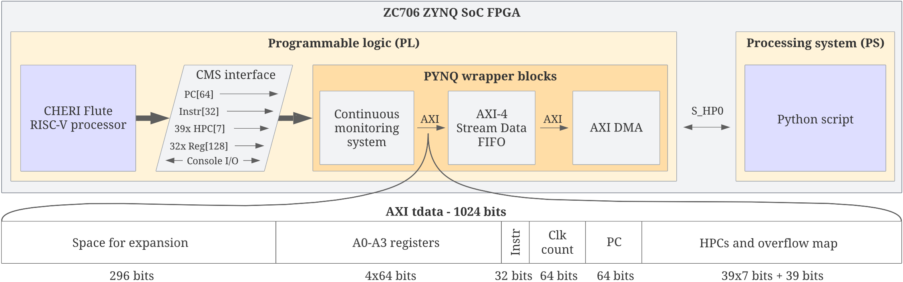

# PYNQ wrapper for Flute processor
This repository contains source files and documentation for a PYNQ design that collects metrics from CHERI-RISC-V (Flute) processor implemented in programmable logic (PL) of the ZC706 board. It includes a continuous monitoring system (CMS) hardware module responsible for filtering and preprocessing extracted data.

# Documentation
Documentation files are in the [docs](./docs) directory and include:
* [setup_guide.md](./docs/setup_guide.md) - step by step guide to get the design up and running
* [data_extraction.md](./docs/data_extraction.md) - what is traced and how
* [console_io.md](./docs/console_io.md) - how to interact with the Flute console input and output 
* [continuous_monitoring_system_configuration.md](./docs/continuous_monitoring_system_configuration.md) - how to customize operation of the CMS module (responsible for filtering/preprocessing of the data)
* [loading_and_running_programs.md](./docs/loading_and_running_programs.md) - how to load a program into memory and run it on the RISC-V processor
* [sensors_extension.md](./docs/sensors_extension.md) - reading analog sensor inputs inside a RISC-V program
* [flute_modifications.md](./docs/flute_modifications.md) - how the Flute processor was modified
* [display.md](./docs/display.md) - information about ESP32-3248S035C display board
* [tcp_server_protocol.md](./docs/tcp_server_protocol.md) - protocol for controlling and getting updates from PYNQ, it is used by the display board
* [use_case.md](./docs/use_case.md) - example use case of the CMS module, monitoring ECG program that displays heart activity

# Example use case
In [this video](https://www.youtube.com/watch?v=mMTVhH6iV2M) PYNQ wrapper is used to detect anomalous behaviour of a CHERI-RISC-V processor. The test involved training a detection model using a baseline "ecg" program and then replacing it with a malicious equivalent "ecg_info_leak" which leaks information through 2nd UART. Decreased similarity of the current processor state to the previously collected dataset ("Avg sim") indicates anomalous behaviour. More information about the test can be found in the [use_case.md](./docs/use_case.md) file.

# Purpose
The main purpose of this wrapper is to help with development and testing of a [continuous monitoring system](https://github.com/michalmonday/continuous_monitoring_system) that will compare program behaviour with its previously recorded profile. Aiming to detect any deviation from original behaviour (e.g. due to malicious interference, or accidental failure due to faulty sensor or other factors). In similar way to previously published work like:  

| Year | Title |  
| ---- | ----- |
| 2001 | “A fast automaton-based method for detecting anomalous program behaviors.” by R. Sekar et al.  |  
| 2003 | “Anomaly detection using call stack information“ by H. Feng et al. |   
| 2006 | “Hardware-assisted run-time monitoring for secure program execution on embedded processors” by D. Arora et al.  |  
| 2012 | “A high-performance, low-overhead microarchitecture for secure program execution” by A.K. Kanuparthi et al.  |  
| 2015 | “A method for detecting abnormal program behavior on embedded devices” by X. Zhai et al.  |  
| 2017 | “Learning execution contexts from system call distribution for anomaly detection in smart embedded system” by M. Yoon et  al. |
| 2017 | “Hardware performance counters based runtime anomaly detection using svm” by M. F. B. Abbas et al.  |  
| 2017 | “Time and sequence integrated runtime anomaly detection for embedded system“ by S. Lu and R. Lysecky  |  
| 2019 | “Data-driven anomaly detection with timing features for embedded systems” by S. Lu and R. Lysecky  |  
| 2019 | “Fdnn: Feature-based deep neural network model for anomaly detection of kpis” by Z. Lan et al.  |  
| 2019 | “Anomaly detection in real-time multi-threaded processes using hardware performance counters” by P. Krishnamurthy  |  
| 2020 | “An m-cache-based security monitoring and fault recovery architecture for embedded processor” by X. Wang et al.  |  
| 2022 | "Identification of Return-Oriented Programming Attacks Using RISC-V Instruction Trace Data" by Daniel F Koranek
| 2022 | "Node Monitoring as a Fault Detection Countermeasure against Information Leakage within a RISC-V Microprocessor" by Donald E Owen

Furthermore, the documentation may serve as a reference for anyone who would like to create similar custom interface/modifications to an open source processor.

# Block design

TODO: describe organization of the block design somewhere, mention how hierarchy was used to separate different parts of the design into higher level blocks.

Click to view a high resolution PDF.

