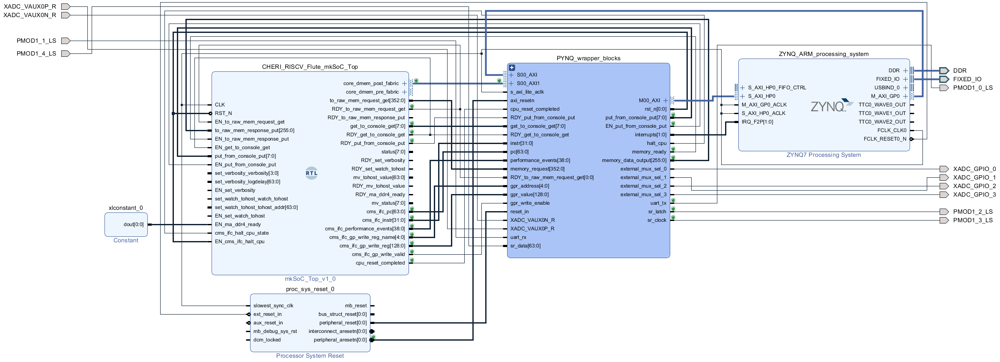

# PYNQ wrapper for Flute processor
This repository contains source files and documentation for a PYNQ design that implements an anomaly-detection oriented tracing system. The main purpose of the design is to detect anomalous program behaviour. The design is implemented in programmable logic (PL) of the ZC706 board where a modified version of CHERI-RISC-V (Flute) processor is placed.

Next to the RISC-V processor, there is a continuous monitoring system (CMS) hardware module responsible for filtering and preprocessing data collected from it. Traced program metrics are sent to the Python script where it is used to train an anomaly detection model. The model is then used to detect anomalous behaviour of the processor, which is then displayed on a wireless Esp32-based [display board](./docs/display.md). The display board is also used to control the CMS and view its state. It allows the user to:  
* load a program into memory (of the CHERI-RISC-V Flute processor)  
* run, halt and resume the program
* enable training/testing modes (independently) of the CMS
* configure the [watchpoint-based tracing](./docs/watchpoint_based_tracing.md) (condition based data collection)
* view how similar the current behaviour of the processor is to the training data (using cosine similarity of collected hardware performance counters)

The project makes use of a [custom I/O extension board](./docs/sensors_extension.md) which allows the RISC-V processor to interact with up to 16 digital (PMOD) and 16 analog (XADC) sensors. In our example [use case](./docs/use_case.md) we utilized an ECG sensor to collect heart activity information and display it on a dedicated screen (pretending to be a proper medical device).

So far we only used hardware performance counters (HPC) for anomaly detection purposes, however the design can be easily adjusted to use other collected metrics like:  
* program counter (PC)
* instruction
* general purpose registers
* console output
* physical sensor readings

Such metrics could be used to create a robust application-specific detection system.

# File structure of this repository

| Directory      | Description |
| ----------- | ----------- |
| docs | Documentation files. |
| images | Documentation images. |
| jupyter_notebooks | Files to be placed on the PYNQ system (/home/xilinx/jupyter_notebooks). [pynq_wrapper.ipynb](./jupyter_notebooks/pynq_wrapper.ipynb) is the top-level script ([pynq_api_script.md](./docs/pynq_api_script.md) describes it). |
| programs | Binary files to be placed on the PYNQ system (/home/xilinx/programs). These files can be first loaded (from the control display) into the CHERI-RISC-V Flute processor, and then executed. |
| design_files | Files to be placed on the PYNQ system (/home/xilinx/design_files). These include the biststream (".bit") and hardware handoff (".hwh") files.  |
| vivado_files | Verilog, constraints and other files relating to the Vivado project. |
| output_files | Data collected for an experiment used in the NEWCAS 2023 publication. |
| setup_files | Files used during setup (e.g. to generate PYNQ SD card image for the ZC706 board). |

# Documentation
Documentation files are in the [docs](./docs) directory and include:
* [vivado_block_design.md](./docs/vivado_block_design.md) - description of the Vivado block design with screenshots using top-down approach
* [pynq_api_script.md](./docs/pynq_api_script.md) - description of the Python script that controls the hardware
* [setup_guide.md](./docs/setup_guide.md) - step by step guide to get the design up and running
* [use_case.md](./docs/use_case.md) - example use case of the CMS module, monitoring ECG program that displays heart activity
* [flute_modifications.md](./docs/flute_modifications.md) - how the Flute processor was modified to facilitate tracing and halting it
* [sensors_extension.md](./docs/sensors_extension.md) - how to read digital and analog sensors in a RISC-V program
* [data_extraction.md](./docs/data_extraction.md) - what is traced and how
* [console_io.md](./docs/console_io.md) - how PYNQ can send and receive console I/O data to/from the RISC-V processor 
* [continuous_monitoring_system_configuration.md](./docs/continuous_monitoring_system_configuration.md) - how to customize operation of the CMS module (responsible for filtering/preprocessing of the data)
* [loading_and_running_programs.md](./docs/loading_and_running_programs.md) - how to load a program into memory and run it on the RISC-V processor
* [display.md](./docs/display.md) - information about ESP32-3248S035C and ESP32-8048S070 display boards (used to control the hardware, display program metrics and more)
* [watchpoint_based_tracing.md](./docs/watchpoint_based_tracing.md) - description, pros, cons and implementation details of watchpoint based tracing implemented in CMS
* [tcp_server_protocol.md](./docs/tcp_server_protocol.md) - protocol for controlling and getting updates from PYNQ, it is used by the display board

# Example use case
In [this video](https://www.youtube.com/watch?v=mMTVhH6iV2M) PYNQ wrapper is used to detect anomalous behaviour of a CHERI-RISC-V processor. The test involved training a detection model using a baseline "ecg" program and then replacing it with a malicious equivalent "ecg_info_leak" which leaks information through 2nd UART. Decreased similarity of the current processor state to the previously collected dataset ("Avg sim") indicates anomalous behaviour. More information about the test can be found in the [use_case.md](./docs/use_case.md) file.

# Purpose
The main purpose of this wrapper is to help with development and testing of a [continuous monitoring system](https://github.com/michalmonday/continuous_monitoring_system) that will compare program behaviour with its previously recorded profile. Aiming to detect any deviation from original behaviour (e.g. due to malicious interference, or accidental failure due to faulty sensor or other factors). In similar way to previously published work like:  

| Year | Title |  
| ---- | ----- |
| 2001 | “A fast automaton-based method for detecting anomalous program behaviors.” by R. Sekar et al.  |  
| 2003 | “Anomaly detection using call stack information“ by H. Feng et al. |   
| 2006 | “Hardware-assisted run-time monitoring for secure program execution on embedded processors” by D. Arora et al.  |  
| 2012 | “A high-performance, low-overhead microarchitecture for secure program execution” by A.K. Kanuparthi et al.  |  
| 2015 | “A method for detecting abnormal program behavior on embedded devices” by X. Zhai et al.  |  
| 2017 | “Learning execution contexts from system call distribution for anomaly detection in smart embedded system” by M. Yoon et  al. |
| 2017 | “Hardware performance counters based runtime anomaly detection using svm” by M. F. B. Abbas et al.  |  
| 2017 | “Time and sequence integrated runtime anomaly detection for embedded system“ by S. Lu and R. Lysecky  |  
| 2019 | “Data-driven anomaly detection with timing features for embedded systems” by S. Lu and R. Lysecky  |  
| 2019 | “Fdnn: Feature-based deep neural network model for anomaly detection of kpis” by Z. Lan et al.  |  
| 2019 | “Anomaly detection in real-time multi-threaded processes using hardware performance counters” by P. Krishnamurthy  |  
| 2020 | “An m-cache-based security monitoring and fault recovery architecture for embedded processor” by X. Wang et al.  |  
| 2022 | "Identification of Return-Oriented Programming Attacks Using RISC-V Instruction Trace Data" by Daniel F Koranek
| 2022 | "Node Monitoring as a Fault Detection Countermeasure against Information Leakage within a RISC-V Microprocessor" by Donald E Owen

Furthermore, the documentation may serve as a reference for anyone who would like to create similar custom interface/modifications to an open source processor.

# Block design

# Notes for the Xilinx Open Hardware competition
Multiple components were used for this project, we'd like to highlight what was produced by us and what wasn't.

## What work was done
* CHERI-RISC-V Flute processor was modified (see [flute_modifications.md](./docs/flute_modifications.md) for details) 
* [Vivado block design](./docs/vivado_block_design.md) was created to facilitate:  
    * data filtering, preprocessing and extraction (CMS module)
    * console I/O (using AXI DMA) 
    * XADC and PMOD sensors reading to dedicated memory accessible by the RISC-V processor
    * memory implementation for the RISC-V processor
* Custom I/O extension board was created to allow RISC-V interact with large number of physical sensors (see [sensors_extension.md](./docs/sensors_extension.md) for details about the parts and wiring)
* ESP32 controlled displays were integrated, this included creation of:
    * custom [GUI library](./display_board/src/lib)
    * multicore Esp32 (Arduino-like) [program](./display_board/src/CMS/cms_program.cpp) to communicate with TCP server on PYNQ and display CMS information on the screen
    * objdump output explorer

## What was not created by us
The [vivado_files/src_verilog](./vivado_files/src_verilog/) directory contains i.a. "RV64ACDFIMSUxCHERI" and "src_bsc_lib_RTL" directories, these contain source code of the CHERI-RISC-V Flute processor, which was copied from the [CTSRD-CHERI:Flute](https://github.com/CTSRD-CHERI/Flute) repository, modified by us (as described in [flute_modifications.md](./docs/flute_modifications.md)), compiled and placed in this repository. We'd like to make it clear that we did not create the processor, we only used it in our project.
