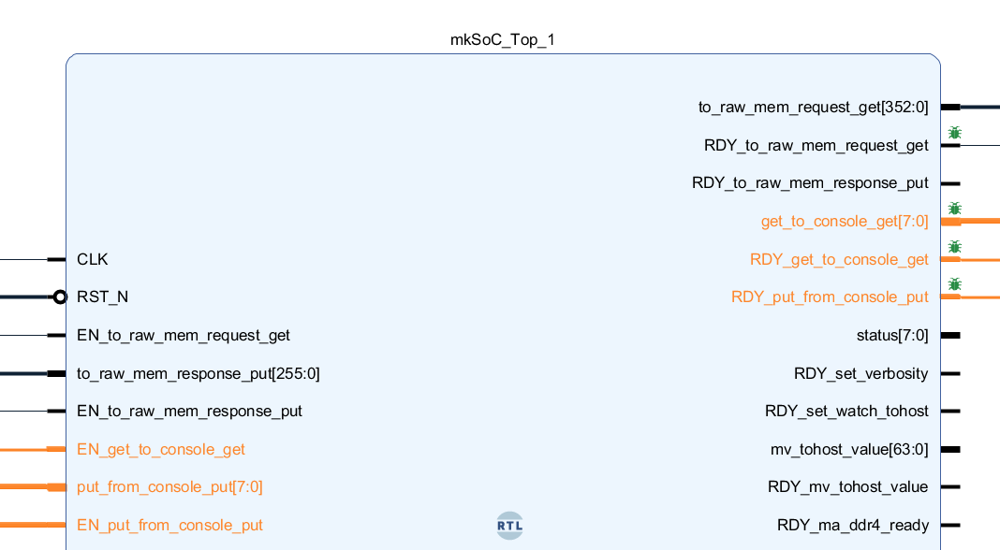

# Table of contents
- [Overview](#overview)
- [What is provided by the Flute itself for controlling console I/O](#what-is-provided-by-the-flute-itself-for-controlling-console-io)
- [How PYNQ wrapper is using what Flute provides](#how-pynq-wrapper-is-using-what-flute-provides)
- [RISC-V code for interacting with console](#risc-v-code-for-interacting-with-console)
    - [Compiler](#compiler)
    - [Source files we used](#source-files-we-used)
- [Python code for interacting with console through AXI DMA](#python-code-for-interacting-with-console-through-axi-dma)
- [AXI DMA module adjustments for console I/O](#axi-dma-module-adjustments-for-console-io)
- [Speed comparison against GPIO based console I/O](#speed-comparison-against-gpio-based-console-io)

# Overview
The diagram is simplified to show high level overview.  


# What is provided by the Flute itself for controlling console I/O

The SoC_Top.v module (generated from the [SoC_Top.bsv](https://github.com/bluespec/Flute/blob/master/src_Testbench/SoC/SoC_Top.bsv)) provided in the open source Flute processor contains handy signals for controlling console input/output.



Signals useful for console output are:
* **get_to_console_get[7:0]** (output) - output character value (e.g. 'H' in "Hello World!" program)
* **RDY_get_to_console_get** (output) - processor indicates that the program it runs outputted a character that is ready to be received by setting it HIGH
* **EN_get_to_console_get** (input) - external user (e.g. PYNQ wrapper) can notify the processor that the character was received by setting it HIGH, this way the processor will set `get_to_console_get[7:0]` to a new character to be outputted (e.g. 'e' in "Hello World!" program)

Signals useful for console input are:  
* **put_from_console_put[7:0]** (input) - input chatacter value set by the external user (e.g. PYNQ wrapper)
* **EN_put_from_console_put** (input) - indicates that the external user (e.g. PYNQ wrapper) set `put_from_console_put[7:0]` to a new character that will be received by the processor
* **RDY_put_from_console_put** (output) - processor indicates that it is ready to receive a new input character by setting it HIGH

# How PYNQ wrapper is using what Flute provides
In the PYNQ wrapper, console input and output is implemented by controlling the 3 processor inputs mentioned above while monitoring the 3 outputs. Additionally, the PYNQ wrapper uses 2 FIFO buffers, one to store output characters before these are read, and one to store input characters. Reading and writing into these buffers is accomplished by using AXI DMA module and the RISC-V processor itself. The AXI DMA module is controlled by the python script and is responsible for:
* reading from output fifo (like stdout)
* writing to input fifo (like stdin)

The RISC-V processor is responsible for:
* writing to output fifo (like stdout)
* reading from input fifo (like stdin)


  


# RISC-V code for interacting with console
As of 27/02/2023 we only tried to run baremetal programs on the Flute processor in the PYNQ wrapper, without using any libraries. The code below is showing how we can interact with the console in such programs:
```C
static volatile int *uart = (int *)(void *)0xC0000000;
#define UART_REG_TXFIFO 0x0
#define UART_REG_RXFIFO 0x0
#define UART_REG_LSR    0x5 // line status reg (read only)

// Bit fields of LSR
#define LSR_BITFIELD_TRANSMITTER_EMPTY 0x40
#define LSR_BITFIELD_THR_EMPTY         0x20
#define LSR_BITFIELD_DATA_READY        0x1

static int putchar(char ch) {
    uart[UART_REG_TXFIFO] = ch;
}

static int data_available() {
    return uart[UART_REG_LSR] & LSR_BITFIELD_DATA_READY;
}

static int getchar() {
    while (!data_available());
    return uart[UART_REG_RXFIFO] & 0xFF;
}

void puts(char *s) {
    while (*s) {
        putchar(*s++);
    }
    putchar('\n');
}
```

### Compiler
We used the [riscv-gnu-toolchain](https://github.com/riscv-collab/riscv-gnu-toolchain) to compile the code. We also attempted to compile the code using the Cheri LLVM compiler, but we were not able to get it to work (as the compiled code appeared to rely on existence of error handling routines which we didn't set, the code was resetting to bootloader after encountering `csetbounds` instruction, in general this was a too difficult task).

### Source files we used
The repository holding files we used for compilation (e.g. linker script) is available in [this fork](https://github.com/michalmonday/riscv-baremetal-minimal-example-c/blob/flute_design/peripherals_test/test.c) of the "riscv-baremetal-minimal-example-c" repository created by Sebastien Bourdelin ([link to original](https://github.com/sbourdelin/riscv-baremetal-minimal-example-c)). We did a lot of experimenting and trials/errors to test different things, which is reflected in the messy contents of our fork. The most important modification required to make the program run on our custom version of the Flute processor was setting the stack address/size in the linker script ([example](https://github.com/michalmonday/riscv-baremetal-minimal-example-c/blob/flute_design/peripherals_test/example_original.ld)) to match the hardware implementation.

# Python code for interacting with console through AXI DMA
We created the Console_IO class (available in [console_io.py](../jupyter_notebooks/console_io.py) file) to make it convenient to interact with the console. Internals of that class take care of controlling the AXI DMA module. Here's a sample usage of the class:
```python
# Example usage of Console_IO class
from pynq import Overlay
import time
from console_io import Console_IO
base = Overlay('imported_design.bit')
console_io = Console_IO( base.axi_dma_0, recv_buffer_capacity=1000, send_buffer_capacity=1000 )
console_io.send( "Hello World!" )
while not console_io.data_available():
    time.sleep(0.01)
print( console_io.read() )
```


# AXI DMA module adjustments for console I/O
In PYNQ wrapper, console input and output was implemented with the assumption that the user should be able to do 3 main actions:
* send arbitrary number of characters to the processor
* check if any characters are available to be read from the processor
* read all available characters from the processor


Using PYNQ 2.7.0 version, it is possible to set specific number of bytes to be sent when calling "dma.sendchannel.transfer" method (using `nbytes` parameter), so the first action is straightforward to implement.

However, it isn't possible to set the number of bytes to be received, because that is determined by the tlast signal. "dma.recvchannel.transfer" method has `nbytes` parameter, but as mentioned in AXI DMA [documentation](https://docs.xilinx.com/r/en-US/pg021_axi_dma/AXI-DMA-Register-Address-Map) (section `S2MM_LENGTH (S2MM DMA Buffer Length Register – Offset 58h)`), setting it below the number of bytes received until "tlast" is asserted will result in undefined behaviour, and error occurs if that happens:  
> "This value must be greater than or equal to the largest expected packet to be received on S2MM AXI4-Stream. Values smaller than the received packet result in undefined behavior."

For that reason the hardware implementation includes module that monitors AXI Lite interface responsible for controlling DMA (e.g. initiating transfers), and when it detects that a receive transfer is requested, it tells the console_io module to include a special "0xFF" byte in output buffer and set tlast HIGH as it is sent.  This way we limit the number of sent characters to the ones that are currently in the buffer. As a resulting side-effect of this implementation, we can initiate transfer to check if any data is available, if data is not available then only 1 byte (0xFF) will arrive.

On the block design below the [axi_dma_receive_transfer_tap_v1_0 module](../vivado_files/src_verilog/custom_hdl/axi_dma_receive_transfer_tap.v) is responsible for monitoring the relevant AXI Lite signals (awaddr, wdata, wready, wvalid) and setting the receive_transfer_request signal accordingly. 


```verilog
// key part of the axi_dma_receive_transfer_tap_v1_0 module
always @(posedge clk) begin
    // 0x58 is the address of the S2MM_LENGTH register in the AXI DMA module,
    // which initiates receive transfer when non-zero value is written to it
    if (axilite_tap_awaddr == 'h58 && 
        axilite_tap_wdata != 0 && 
        axilite_tap_wready &&
        axilite_tap_wvalid)  // awvalid is not checked, because it seemed to be always HIGH
                             // when wvalid was HIGH (this may be naive and be potentially 
                             // dangerous assumption, but it saves some visual wire mess that is already 
                             // there when connecting to individual signals of AXI bus)
    begin
        receive_transfer_request <= 1'b1;
    end
    else begin
        receive_transfer_request <= 1'b0;
    end
end
```

It is worth to notice that when connecting to individual lines of a bus in Vivado (like AXI Lite), both sides of original connection must be connected (that is the reason why each of the orange wires on the block design above is connected to 3 modules), otherwise the other end (originally connected) will be connected to ground, potentially resulting in the following error encountered during implementation stage:
> [DRC 23-20] Rule violation (MDRV-1) Multiple Driver Nets - Net <const0> has multiple drivers: GND/G, VCC/P.  
> 
Which happens when the port accidentally connected to ground happens to be an output, attempting to drive GND with its value (that is my assumption).


# Speed comparison against GPIO based console I/O
Initially, due to lack of understanding of the AXI DMA module, console I/O was implemented using AXI GPIO block ([old/console_io.md](./old/console_io.md)). This was very slow, we tested that implementation with an "echo" like program that reads characters from the console and outputs them back. Reading a single character took approximately 0.02s (meaning that reading 1000 characters would take 20s, and this time did not include anything other than reading (like sending, or time inbetween). We used the following time check to measure this, which was directly placed in the `console_read()` function: 

```python
# AXI GPIO based console I/O, single char read time check
start_time = time.time()
last_char_time = start_time
while console_data_available():
    console_read_enable.off()
    console_read_enable.on()
    s += chr(console_output.read())
    print(f'Reading char took: {time.time() - last_char_time}s')
    last_char_time = time.time()
```

Using the DMA based implementation, in a simple test we were able to send and read 110000 characters in 2.75s, 1 character every 0.000025s, so the effective speed is at least 800x faster. In this measurement we additionally included the sending time and printing time, we used the following code:

```python
# AXI DMA based console I/O, total sending and reading time check
start_time = time.time()
for i in range(1000):
    console_io.send('hello_world'*10, wait=True) # 'hello_world'*10 becomes a string containing 110 characters
    print( console_io.read() )
print(f'{time.time() - start_time}s')
```

