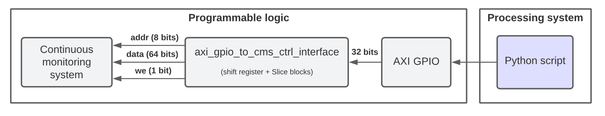

# Table of contents
- [Overview](#overview)
- [What can be configured](#what-can-be-configured)
- [Hardware interface used for configuration](#hardware-interface-used-for-configuration)
- [Software used for configuration (PYNQ API)](#software-used-for-configuration-pynq-api)
- [Verilog implementation details](#verilog-implementation-details)


# Overview



# What can be configured
The [continuous_monitoring_system](https://github.com/michalmonday/continuous_monitoring_system) (cms) module can be configured to:  
* Supply trace start/end addresses (and enable both optionally)
* Supply monitored address range (lower bound + higher bound + enable both optionally)

# Hardware interface used for configuration
Configuration is done by interacting with the AXI GPIO module connected to the `continuous_monitoring_module` control inputs:
* **ctrl_addr (8 bits)** (selects which functionality to adjust)
* **ctrl_wdata (64 bits)** (provides address/value/decision for the currently selected functionality by the ctrl_addr)
* **ctrl_write_enable (1 bit)** (indicates that ctrl_addr and ctrl_wdata were already set and some functionality can be adjusted using their values)

Image below shows the AXI GPIO module and surrounding circuitry (shift register, Slice blocks) that allow to control all 73 control bits of the `continuous_monitoring_system` module using AXI GPIO that has only 32-bit output per channel.


# Software used for configuration (PYNQ API)
[continuous_monitoring_system_controller.py](../jupyter_notebooks/continuous_monitoring_system_controller.py) file implements a class that provides high-level methods and interacts with AXI GPIO underneath. The code below is a part of [pynq_wrapper.ipynb](../jupyter_notebooks/pynq_wrapper.ipynb) and presents how that class is used to configure the module (`cms_ctrl` is the object). 
```python
from continuous_monitoring_system_controller import ContinuousMonitoringSystemController

def setup_cms(cms_ctrl):
    # Triggerring (exact address must match to start/stop trace)
    cms_ctrl.set_trigger_trace_start_address(0x1000)
    cms_ctrl.set_trigger_trace_end_address(0x80000106)  
    cms_ctrl.set_trigger_trace_start_address_enabled(False)
    cms_ctrl.set_trigger_trace_end_address_enabled(False)

    # Filtering (any address between lower bound and upper bound will be collected)
    cms_ctrl.set_monitored_address_range_lower_bound(0x0FFF)     #(0x80000000)
    cms_ctrl.set_monitored_address_range_upper_bound(0x800000FF)
    cms_ctrl.set_monitored_address_range_lower_bound_enabled(False)
    cms_ctrl.set_monitored_address_range_upper_bound_enabled(False)
    
    # Allow further trace collection if last traced program used "wfi"
    # (wait for interrupt) instruction which stops the trace.
    cms_ctrl.reset_wfi_wait()
    cms_ctrl.set_tlast_interval(TLAST_INTERVAL)
    
    cms_ctrl.enable_halting_cpu()
    
    # Advanced trace filter (ATF) configuration
    cms_ctrl.reset_atf()
    
    # DIRECT MATCH ATF WATCHPOINTS (determining when data is collected):
    #cms_ctrl.set_atf_match_watchpoint(0, {'pc':0x8000076c})
    #cms_ctrl.set_atf_match_watchpoint(0, {'pc':0x80000760}) # ecg_baseline wait_ms
    #cms_ctrl.set_atf_match_watchpoint(0, {'pc':0x800008B0}) # ecg_baseline wait_ms_2
    cms_ctrl.set_atf_mode(ATF_MODE.ANOMALY_DETECTION) # alternative: ATF_MODE.PATTERN_COLLECTION
    cms_ctrl.enable_atf()

# the long name is because of using hierarchy in Vivado block design
cms_ctrl_axi_gpio = base.PYNQ_wrapper_blocks.continuous_monitoring_system_blocks.axi_gpio_to_cms_ctrl_interface.axi_gpio_cms_ctrl.channel1    
cms_ctrl = ContinuousMonitoringSystemController(cms_ctrl_axi_gpio)
setup_cms(cms_ctrl)
```


# Verilog implementation details
The code below is a part of [continous_monitoring_system.sv](https://github.com/michalmonday/continuous_monitoring_system/blob/master/src/continuous_monitoring_system.sv) responsible for its configuration using control inputs.

```verilog
// if write enable is active (posedge/level triggered mode can be selected by CTRL_WRITE_ENABLE_POSEDGE_TRIGGERED)
if ((CTRL_WRITE_ENABLE_POSEDGE_TRIGGERED & ctrl_write_enable_pos_edge) || (~CTRL_WRITE_ENABLE_POSEDGE_TRIGGERED & ctrl_write_enable)) begin
    case(ctrl_addr)
        // trace trigger enables and addresses (must match the current PC exactly to trigger)
        TRIGGER_TRACE_START_ADDRESS_ENABLED: begin
            trigger_trace_start_address_enabled <= ctrl_wdata;
        end 
        TRIGGER_TRACE_END_ADDRESS_ENABLED: begin
            trigger_trace_end_address_enabled <= ctrl_wdata;
        end
        TRIGGER_TRACE_START_ADDRESS: begin
            trigger_trace_start_address <= ctrl_wdata;
        end
        TRIGGER_TRACE_END_ADDRESS: begin
            trigger_trace_end_address <= ctrl_wdata;
        end

        // monitored address range (must be within the range to collect trace)
        MONITORED_ADDRESS_RANGE_LOWER_BOUND_ENABLED: begin
            monitored_address_range_lower_bound_enabled <= ctrl_wdata;
        end
        MONITORED_ADDRESS_RANGE_UPPER_BOUND_ENABLED: begin
            monitored_address_range_upper_bound_enabled <= ctrl_wdata;
        end
        MONITORED_ADDRESS_RANGE_LOWER_BOUND: begin
            monitored_address_range_lower_bound <= ctrl_wdata;
        end
        MONITORED_ADDRESS_RANGE_UPPER_BOUND: begin
            monitored_address_range_upper_bound <= ctrl_wdata;
        end

        // WFI reached can be used to reset (it is reset anyway after loading Overlay again)
        WFI_STOPPED: begin
            wfi_stop <= ctrl_wdata;
        end
        CLK_COUNTER: begin
            clk_counter <= ctrl_wdata;
        end
        LAST_WRITE_TIMESTAMP: begin
            last_write_timestamp <= ctrl_wdata;
        end

        default: begin
            // do nothing
        end
    endcase
end
```
