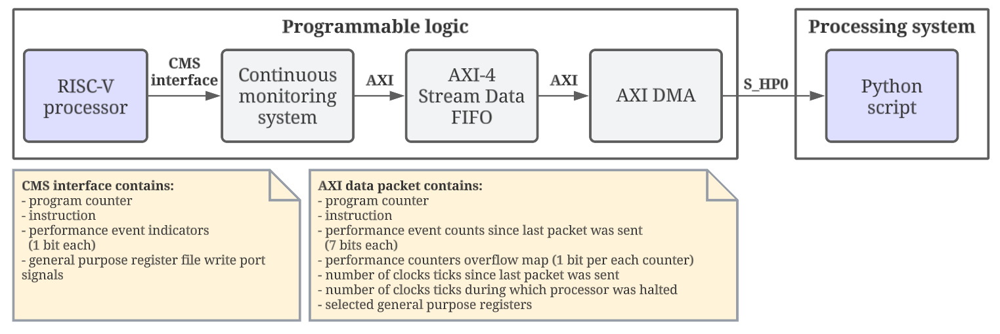
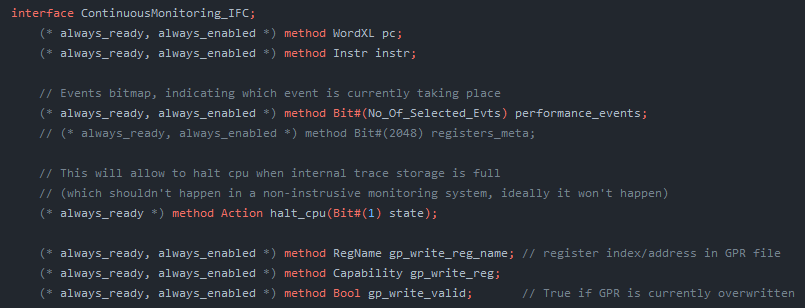

# Table of contents
- [From where to where data is transferred](#from-where-to-where-data-is-transferred)
    - [Data transfer path](#data-transfer-path)
- [How data is extracted](#how-data-is-extracted)
- [What data is collected](#what-data-is-collected)
    - [Example collected data (performance counters not shown)](#example-collected-data-performance-counters-not-shown)
    - [Example collected data (performance counters)](#example-collected-data-performance-counters)
- [How much data can be collected](#how-much-data-can-be-collected)
    - [Possible way to handle low speed/low memory](#possible-way-to-handle-low-speedlow-memory)
- [Data filtering modes](#data-filtering-modes)
  - [Basic filtering](#basic-filtering)
  - [Watchpoing based filtering](#watchpoing-based-filtering)
- [Performance counters selection](#performance-counters-selection)
- [Note about performance counters extraction](#note-about-performance-counters-extraction)


# From where to where data is transferred
The data is collected from a modified version of RISC-V (Flute) processor (running a baremetal program) implemented in programmable logic (PL) of ZC706 board and delivered to the processing system (PS) of the same board running PYNQ image (Linux). 

The transfer is initiated on PS by using PYNQ API (python `pynq` module), after receiving the data transfer the data is available for further processing in the python script that initiated the transfer.

### Data transfer path

<p>

</p>


# How data is extracted 
The processor (implemented in Bluespec Verilog language) is modified to propagate relevant signals outside of the processor (ContinuousMonitoringSystem_IFC is used to group all these signals together, where IFC stands for interface). Extracted signals include: 
- program counter
- instruction
- 39 performance event indicating bits (each indicating different performance event currently taking place)
- general purpose register (GPR) file write port signals

Image below presents ContinousMonitoringSystem_IFC declaration in the [ContinuousMonitoringSystem_IFC.bsv](https://github.com/michalmonday/Flute/blob/continuous_monitoring/src_Core/CPU/ContinuousMonitoring_IFC.bsv):  


Image below presents how that interface is defined in the [CPU.bsv](https://github.com/michalmonday/Flute/blob/continuous_monitoring/src_Core/CPU/CPU.bsv) (showing only 8 of 39 extracted performance event indicators):  


Continuous monitoring system module (`cms_ip_wrapper` on image below) receives these signals as inputs, it then decides whether or not to collect them (that is elaborated in [Data filtering modes](#data-filtering-modes) section). The continuous monitoring module is responsible for counting each performance event, and counting clock cycles since last collected item. If the data item is to be collected, it turns all values into a single 1024 bit vector and transfers it to AXI4-Stream Data FIFO using AXI protocol. Contents of that 1024 bit vector are described in the [What data is collected](#what-data-is-collected) section.
<!--  -->


After delivering the data to FIFO, the AXI DMA may be requested to transfer the contents of it into previously allocated contiguous memory. This kind of allocation was accomplished by using `allocate` function from the PYNQ API, requesting transfer is done by using PYNQ API as well (shown below). Control over AXI DMA module is possible through `S_AXI_LITE` port (connected to PS, thus controllable from python script)

```python
from pynq import Overlay
from pynq import allocate
AXI_DATA_WIDTH = 1024

def get_dma_transfer(input_buffer, dma_rec, dont_wait=False):
    ''' Returns the number of transferred items, each having 1024 bits. '''
    dma_rec.transfer(input_buffer)
    if not dont_wait:
        dma_rec.wait() 
    items_transferred = math.floor(dma_rec.transferred * 64 / AXI_DATA_WIDTH / 8)
    print(f'items_transferred = {items_transferred}')
    return items_transferred

base = Overlay('imported_design.bit')
dma_rec = base.continuous_monitoring_system_blocks.axi_dma_0.recvchannel
input_buffer = allocate(shape=(buffer_length,), dtype='u8')
items_transferred = get_dma_transfer(input_buffer, dma_rec)
```

[pynq_wrapper.ipynb](../jupyter_notebooks/pynq_wrapper.ipynb) contains the full code used for controlling/testing the design.


# What data is collected
Each collected data item (`data_pkt` variable in [continuous_monitoring_system.sv](../vivado_files/src_verilog/continuous_monitoring_system_src/continuous_monitoring_system.sv)) received by the python script contains:
* program counter (64 bits), collected as it is passed from stage 1 to stage 2 of the CPU pipeline
* instruction (32 bits), collected as it is passed from stage 1 to stage 2 of the CPU pipeline
* clock ticks count since last extracted item (64 bits)
* clock ticks since processor was halted since last extracted item (64 bits) 
* 39 performance counters (7 bits each) indicating how many of each events occured since last extracted item
* performance counters overflow map (39 bits), indicating which counters have to be treated as modulo of 128 values (due to going over their maximum value limited by 7 bits)
* 4 selected general purpose registers (A0 - A3)

### Example collected data (performance counters not shown)

  

### Example collected data (performance counters)
Each row corresponds to each row from table above. It's shown in 2 separate tables because of the image width.

  

# How much data can be collected
Currently the AXI-4 Stream Data FIFO depth is set to 2000 items. A single run of the [stack-mission](https://github.com/michalmonday/riscv-baremetal-minimal-example-c/blob/flute_design/stack-mission.c) program results in around 1300 items being collected (under assumption that it immediately receives data through standard input instead of waiting for it). Halting mechanism is implemented which halts the processor until the FIFO is not full. Halting is enabled by default but can be optionally disabled or enabled using the following commands:
```python
from continuous_monitoring_system_controller import ContinuousMonitoringSystemController
# the long name is because of using hierarchy in Vivado block design
cms_ctrl_axi_gpio = base.PYNQ_wrapper_blocks.continuous_monitoring_system_blocks.axi_gpio_to_cms_ctrl_interface.axi_gpio_cms_ctrl.channel1    
cms_ctrl = ContinuousMonitoringSystemController(cms_ctrl_axi_gpio)
cms_ctrl.disable_halting_cpu()
#cms_ctrl.enable_halting_cpu()
```
Disabling the halting mechanism can be useful when testing features of design other than trace collection (e.g. console interaction, sensor data collection by the RISC-V program, etc.)

<!-- *stack-mission program is a slightly modified version of the [original stack-mission program from cheri-exercises](https://github.com/CTSRD-CHERI/cheri-exercises/blob/master/src/missions/uninitialized-stack-frame-control-flow/stack-mission.c) (modified to avoid using any libraries) -->

### Possible way to handle low speed/low memory
Inability to collect/process the data fast enough is a major shortcoming of this design, especially that python is relatively slow. One way to tackle that issue would be to change granularity of data collection (e.g. collect data every function call/return instead of every branch/jump/return, possibly this could involve collecting frequency distribution of certain events, similarly to performance counters collection). 

# Data filtering modes

The `continuous_monitoring_system` module is configurable and may be set to only collect data when program counter is within range. Or to start/stop collection when it reaches specific value. See [continuous_monitoring_system_configuration.md](./continuous_monitoring_system_configuration.md) for more details.

## Basic filtering
Before introducing the watchpoint based filtering, data items were only collected when program counter changes value and the current instruction is either a branch, jump, return or any instruction immediately following these.

## Watchpoing based filtering
This is the currently used filtering, it is described in the [watchpoint_based_tracing.md](./watchpoint_based_tracing.md) file. It was introduced to reduce the amount of collected data and allow software (python script) to process data in real time (to detect anomalies).

# Performance counters selection
The Flute processor has 115 performance counters. In our test we ran a baremetal short program and repeatedly collected all 115 counter values, we observed that 78 of them always had all values equal to 0. We decided to extract only the remaining 37 + 2 additional ones: `Core__TRAP` and `Core__INTERRUPT`.

# Note about performance counters extraction
By looking at the ContinousMonitoring_IFC definition from CPU.bsv we can see that only the first bit of each event counter is extracted. That is because by default these event counters are not counting but only indicating which event currently happens by using 1st bit. These counters need to be configured in order to count and because I don't know how to do that exactly, I decided to count them in the `continuous_monitoring_system` module outside of the processor (not very elegant solution but it works).  

Proper solution was kindly suggested by Jessica:  


