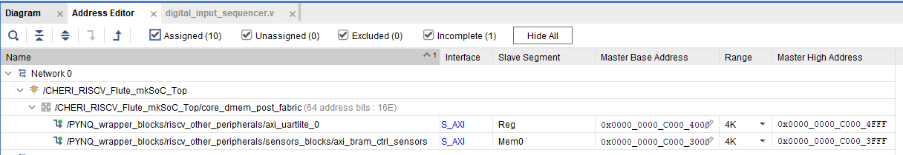

# Table of contents
- [Overview](#overview)
- [Propagation of relevant signals outside and into the SoC](#propagation-of-relevant-signals-outside-and-into-the-soc)
    - [ContinuousMonitoring interface declaration](#continuousmonitoring-interface-declaration)
    - [ContinuousMonitoring interface definition](#continuousmonitoring-interface-definition)
    - [Propagating ContinuousMonitoring interface](#propagating-continuousmonitoring-interface)
    - [Halting the CPU](#halting-the-cpu)
    - [cpu\_reset\_completed signal](#cpu_reset_completed-signal)
- [Extending the internal fabric (interconnect) of the Soc\_Top module.](#extending-the-internal-fabric-interconnect-of-the-soc_top-module)
    - [Soc\_Top.bsv](#soc_topbsv)
    - [Soc\_Map.bsv](#soc_mapbsv)
- [General purpose registers (GPR) file access](#general-purpose-registers-gpr-file-access)
    - [Use of CReg](#use-of-creg)


# Overview
Flute processor is written in Bluespec Verilog language (".bsv" extension). Bluespec Verilog files are compiled into Verilog files using bsc compiler. 

We modified the Flute processor in the following ways:
* signals relevant for tracing were propagated from the CPU to the outside of the SoC
* a new port was added to the internal fabric (interconnect) of the Soc_Top module (allowing RISC-V to interact with custom peripherals we wish to use, like the [sensors extension board](./sensors_extension.md))
* write port of general purpose registers (GPR) file is monitored (for the sake of creating a shadow copy of GPRs in our Continuous Monitoring System)

In the following sections these modifications are described in more detail.


# Propagation of relevant signals outside and into the SoC
### ContinuousMonitoring interface declaration
[ContinuousMonitoring_IFC.bsv](https://github.com/michalmonday/Flute/blob/continuous_monitoring/src_Core/CPU/ContinuousMonitoring_IFC.bsv) file was created and it contains the declaration of the ContinousMonitoring_IFC (IFC standing for interface). In Bluespec Verilog language, interfaces are grouping input and output ports of modules. Interfaces can include other interfaces, allowing to easily group and manage large number of ports (in standard Verilog each port needs to be declared separately). The ContinuousMonitoring_IFC groups ports that had to be propagated from the CPU itself, all the way outside the Soc_Top module, as well as the halt_cpu input signal. Below is the declaration of that interface:
```verilog
interface ContinuousMonitoring_IFC;
    // "Value" methods return signal value (they can be understood to be output ports)
    (* always_ready, always_enabled *) method WordXL pc;
    (* always_ready, always_enabled *) method Instr instr; 
    (* always_ready, always_enabled *) method Bit#(No_Of_Selected_Evts) performance_events; // Events bitmap, indicating which event is currently taking place
    (* always_ready, always_enabled *) method RegName gp_write_reg_name;
    (* always_ready, always_enabled *) method Capability gp_write_reg;
    (* always_ready, always_enabled *) method Bool gp_write_valid;
    // OLD WAY:
    // (* always_ready, always_enabled *) method Bit#(512) registers;

    // Action method applies some action (it can be understood to be an input port), which 
    // affects the internal state of module having this interface (CPU in this case)
    (* always_ready *) method Action halt_cpu(Bit#(1) state);
endinterface
```

### ContinuousMonitoring interface definition
Methods/ports declared in the ContinousMonitoring_IFC file, are defined in the [CPU.bsv](https://github.com/michalmonday/Flute/blob/continuous_monitoring/src_Core/CPU/CPU.bsv) in the following way:

```verilog
interface ContinuousMonitoring_IFC cms_ifc;
    method Action halt_cpu(Bit#(1) state);
        cms_halt_cpu <= state; 
    endmethod

    method WordXL pc; 
        return getPC(stage1.out.data_to_stage2.pcc);
    endmethod

    method Instr instr; 
        return stage1.out.data_to_stage2.instr;
    endmethod

    // returns index/address of register in GPR file
    method RegName gp_write_reg_name;
        return gpr_regfile.written_reg_name();
    endmethod

    method Capability gp_write_reg;
    // Defitinition of the packCap function:
    // function Capability packCap(CapFat fat);
    //   CapabilityInMemory thin = CapabilityInMemory{
    //       isCapability: fat.isCapability
    //     , perms:        fat.perms
    //     , flags:        fat.flags
    //     , reserved:     fat.reserved
    //     , otype:        fat.otype
    //     , bounds:       encBounds(fat.format,fat.bounds)
    //     , address:      fat.address };
    //   return pack(thin);
    // endfunction
        CapReg cr = gpr_regfile.written_reg_value();
        return packCap(cr);
    endmethod

    // returns True if GPR file is being written to currently
    method Bool gp_write_valid;
        return gpr_regfile.written_reg_valid();
    endmethod

    // OLD WAY:
    // method Bit#(512) registers;
    //     Bit #(512) registers_local = 0;
    //     // A0 - A3 only 
    //     CapPipe cp = gpr_regfile.read_cms (fromInteger(10)); registers_local[0*128+127:0*128] = {pack(getMeta(cp)), pack(getAddr(cp))};
    //     cp = gpr_regfile.read_cms2 (fromInteger(11)); registers_local[1*128+127:1*128] = {pack(getMeta(cp)), pack(getAddr(cp))};
    //     cp = gpr_regfile.read_cms3 (fromInteger(12)); registers_local[2*128+127:2*128] = {pack(getMeta(cp)), pack(getAddr(cp))};
    //     cp = gpr_regfile.read_cms4 (fromInteger(13)); registers_local[3*128+127:3*128] = {pack(getMeta(cp)), pack(getAddr(cp))};

    //     return registers_local;
    // endmethod

    method Bit#(No_Of_Selected_Evts) performance_events;
        Bit#(No_Of_Selected_Evts) performance_events_local = 0;
        performance_events_local[0] = events[2][0]; // Core__TRAP
        performance_events_local[1] = events[3][0]; // Core__BRANCH
        performance_events_local[2] = events[4][0]; // Core__JAL
        performance_events_local[3] = events[5][0]; // Core__JALR
        performance_events_local[4] = events[6][0]; // Core__AUIPC
        performance_events_local[5] = events[7][0]; // Core__LOAD
        performance_events_local[6] = events[8][0]; // Core__STORE
        performance_events_local[7] = events[12][0]; // Core__SERIAL_SHIFT
        performance_events_local[8] = events[16][0]; // Core__LOAD_WAIT
        performance_events_local[9] = events[17][0]; // Core__STORE_WAIT
        performance_events_local[10] = events[19][0]; // Core__F_BUSY_NO_CONSUME
        performance_events_local[11] = events[21][0]; // Core__1_BUSY_NO_CONSUME
        performance_events_local[12] = events[22][0]; // Core__2_BUSY_NO_CONSUME
        performance_events_local[13] = events[30][0]; // Core__INTERRUPT
        performance_events_local[14] = events[32][0]; // L1I__LD
        performance_events_local[15] = events[33][0]; // L1I__LD_MISS
        performance_events_local[16] = events[34][0]; // L1I__LD_MISS_LAT
        performance_events_local[17] = events[41][0]; // L1I__TLB
        performance_events_local[18] = events[48][0]; // L1D__LD
        performance_events_local[19] = events[49][0]; // L1D__LD_MISS
        performance_events_local[20] = events[50][0]; // L1D__LD_MISS_LAT
        performance_events_local[21] = events[51][0]; // L1D__ST
        performance_events_local[22] = events[57][0]; // L1D__TLB
        performance_events_local[23] = events[66][0]; // TGC__READ
        performance_events_local[24] = events[67][0]; // TGC__READ_MISS
        performance_events_local[25] = events[71][0]; // AXI4_Slave__AW_FLIT
        performance_events_local[26] = events[72][0]; // AXI4_Slave__W_FLIT
        performance_events_local[27] = events[73][0]; // AXI4_Slave__W_FLIT_FINAL
        performance_events_local[28] = events[74][0]; // AXI4_Slave__B_FLIT
        performance_events_local[29] = events[75][0]; // AXI4_Slave__AR_FLIT
        performance_events_local[30] = events[76][0]; // AXI4_Slave__R_FLIT
        performance_events_local[31] = events[77][0]; // AXI4_Slave__R_FLIT_FINAL
        performance_events_local[32] = events[78][0]; // AXI4_Master__AW_FLIT
        performance_events_local[33] = events[79][0]; // AXI4_Master__W_FLIT
        performance_events_local[34] = events[80][0]; // AXI4_Master__W_FLIT_FINAL
        performance_events_local[35] = events[81][0]; // AXI4_Master__B_FLIT
        performance_events_local[36] = events[82][0]; // AXI4_Master__AR_FLIT
        performance_events_local[37] = events[83][0]; // AXI4_Master__R_FLIT
        performance_events_local[38] = events[84][0]; // AXI4_Master__R_FLIT_FINAL
        // for (Integer i=0; i<valueOf(No_Of_Evts); i=i+1)
        //       performance_events_local[i] = events[i][0];
        return performance_events_local;
    endmethod
```

### Propagating ContinuousMonitoring interface 
Each intermediate module from the CPU to SoC_Top had to include the newly created interface. Its declaration had to be added in the following 3 existing interfaces:
* [CPU_IFC.bsv](https://github.com/michalmonday/Flute/blob/continuous_monitoring/src_Core/CPU/CPU_IFC.bsv)  
* [Core_IFC.bsv](https://github.com/michalmonday/Flute/blob/continuous_monitoring/src_Core/Core/Core_IFC.bsv)  
* [Soc_Top.bsv](https://github.com/michalmonday/Flute/blob/continuous_monitoring/src_Testbench/SoC/SoC_Map.bsv) - (Soc_Map_IFC is in the same file with definition of Soc_Top module)  

In all 3 cases it involved adding the same line in the interface declaration:
```verilog
    // Requires the following include at the top of the file:
    // import ContinuousMonitoring_IFC :: *;
    interface ContinuousMonitoring_IFC cms_ifc;
```

The definition of each interface also had to be added in 3 corresponding modules:
* [CPU.bsv](https://github.com/michalmonday/Flute/blob/continuous_monitoring/src_Core/CPU/CPU.bsv) - the long definition included above  
* [Core.bsv](https://github.com/michalmonday/Flute/blob/continuous_monitoring/src_Core/Core/Core.bsv) - The follwing line was added: `interface cms_ifc = cpu.cms_ifc;` 
* [SoC_Top.bsv](https://github.com/michalmonday/Flute/blob/continuous_monitoring/src_Testbench/SoC/SoC_Map.bsv) - The following line was added: `interface cms_ifc = core.cms_ifc;` 


The resulting cms_ifc pins can be seen on the diagram below:  


### Halting the CPU
Fortunately, the CPU.bsv contains a "halting" internal signal. We added an "OR" condition to control it from an external pin (controlled by the fill level of PYNQ wrapper trace storage which halts the CPU when the storage is full).
```verilog
Bool halting = (stop_step_halt || mip_cmd_needed || (interrupt_pending && stage1_has_arch_instr) || unpack(cms_halt_cpu));
```


### cpu_reset_completed signal
The cpu_reset_completed signal is used to indicate that the CPU has completed its reset sequence. It was needed because we recognized that the processor was "eating" the first character of console input FIFO despite RST_N signal being active (active low). Using the cpu_reset_completed signal we are able to recognize when the cpu is ready to receive the first character of the input. Adding that signal required the following additions in the [SoC_Top.bsv](https://github.com/michalmonday/Flute/blob/continuous_monitoring/src_Testbench/SoC/SoC_Top.bsv) file:
```verilog
    // these 2 lines in the interface declaration
    (* always_enabled, always_ready *)
    interface Bool cpu_reset_completed;

    // and these lines in the Soc_Top module definition
    Reset rst_n <- exposeCurrentReset; // clk and reset signals in bluespec are generated automatically, exposeCurrentReset is a builtin way of getting the reset value in bluespec code
    Reg#(Bool) rg_cpu_reset_completed <- mkReg(False, reset_by rst_n);

    // and this line in the "fa_reset_complete_actions" function
    rg_cpu_reset_completed <= True;
```


# Extending the internal fabric (interconnect) of the Soc_Top module.

### Soc_Top.bsv
In order to allow the RISC-V program interact with custom hardware, like the [sensors extension board](./sensors_extension.md) the PYNQ wrapper uses, it was necessary to create another port in the internal fabric (interconnect) of the Soc_Top module. The [Soc_Top](https://github.com/michalmonday/Flute/blob/continuous_monitoring/src_Testbench/SoC/SoC_Top.bsv) module internal fabric/bus interconnects multiple AXI master ports (instruction, data and I/O, optional accelerator) with multiple AXI slave ports (memory controller, uart, boot rom, optional accelerator). Code parts below (from the Soc_Top.bsv file) show key parts where that is defined in the unmodified Flute:

```verilog
    // CPU IMem master to fabric
    master_vector[imem_master_num] = prepend_AXI4_Master_id(0, zero_AXI4_Master_user(core.cpu_imem_master));

    // CPU DMem master to fabric
    master_vector[dmem_master_num] = core.core_mem_master; 

    // Fabric to Boot ROM
    mkConnection(boot_rom_axi4_deburster.master, boot_rom.slave);
    slave_vector[boot_rom_slave_num] = zero_AXI4_Slave_user(boot_rom_axi4_deburster.slave);
    route_vector[boot_rom_slave_num] = soc_map.m_boot_rom_addr_range;

    // Fabric to Mem Controller
    mkConnection(mem0_controller_axi4_deburster.master, mem0_controller.slave);
    slave_vector[mem0_controller_slave_num] = zero_AXI4_Slave_user(mem0_controller_axi4_deburster.slave);
    route_vector[mem0_controller_slave_num] = soc_map.m_mem0_controller_addr_range;

    // Fabric to UART0
    slave_vector[uart0_slave_num] = zero_AXI4_Slave_user(uart0.slave);
    route_vector[uart0_slave_num] = soc_map.m_uart0_addr_range;

    let bus <- mkAXI4Bus ( routeFromMappingTable(route_vector)
                            , master_vector, slave_vector);
```

To extend the internal fabric with a `other_peripherals` port, the following key part was added in the Soc_Top.bsv:
```verilog
   let s_otherPeripheralsPortShim <- mkAXI4ShimFF;
   let s_otherPeripheralsPort_master_sig <- toAXI4_Master_Sig( s_otherPeripheralsPortShim.master );

   // Fabric to other peripherals
   slave_vector[other_peripherals_slave_num] = zero_AXI4_Slave_user(s_otherPeripheralsPortShim.slave);
   route_vector[other_peripherals_slave_num] = soc_map.m_other_peripherals_addr_range;
```
The `other_peripherals` port ultimately connects to smartconnect block in PYNQ wrapper block design (it is called `core_dmem_post_fabric` on the image below).


### Soc_Map.bsv

It can be noticed that the route_vector entry of `other_peripherals` is set to an address range of that port, this was specified in the [Soc_Map.bsv](https://github.com/michalmonday/Flute/blob/continuous_monitoring/src_Testbench/SoC/SoC_Map.bsv) file which also had to be modified to provide the following address range definition:
```verilog
   let other_peripherals_addr_range = Range {
      base: 'hC000_3000,
      size: 'h0000_4000     
   };
```

The address range length is set to 0x4000, but only some of this address range is used:  
* 16 locations for analog sensors
* 16 locations for digital sensors
* small range for UART (AXI Uartlite), which we used to send heart activity values to an ECG display, (this is a separate UART, located at 0xC000_4000, not to be confused with UART0 located at 0xC000_0000, which is controlled by the PYNQ/Python script)
* 1 location for timer since last CPU reset (get_ticks_count function) 
* 1 location for timer since loading Overlay (get_overlay_ticks_count function)
* 1 location for random number generator (unused in this project yet)

The implementation of the last 3 can be found in the [utils_rom.v](../vivado_files/src_verilog/custom_hdl/utils_rom.v) file.

To see how to interact with these components in C/C++ language see `utils_flute.h/.c` and `sensors.h/.c` from [this directory](https://github.com/michalmonday/riscv-baremetal-minimal-example-c/tree/flute_design/include).

The address range from the Soc_Map.bsv (RISC-V source code) corresponds to the one specified for the AXI BRAM Controller (connected to smartconnect on the image above) in the PYNQ wrapper block design. 



The new address range had to be added to the existing `fn_is_IO_addr` function:
```verilog
   // ----------------------------------------------------------------
   // I/O address predicate
   // Identifies I/O addresses in the Fabric.
   // (Caches need this information to avoid cacheing these addresses.)

   function Bool fn_is_IO_addr (Fabric_Addr addr);
      return (   inRange(near_mem_io_addr_range, addr)
              || inRange(plic_addr_range, addr)
              || inRange(uart0_addr_range, addr) 
              || inRange(other_peripherals_addr_range, addr));
   endfunction
```

The part of Soc_Map.bsv setting the number of AXI ports (and setting each port index) also had to be modified using the following code:
```verilog
Integer imem_master_num   = 0;
Integer dmem_master_num   = 1;
Integer accel0_master_num = 2;

Integer boot_rom_slave_num        = 0;
Integer mem0_controller_slave_num = 1;
Integer uart0_slave_num           = 2;
Integer accel0_slave_num          = 3;

`ifdef INCLUDE_ACCEL0
   typedef 3 Num_Masters;
   typedef 5 Num_Slaves;
   Integer other_peripherals_slave_num = 4;
`else
   typedef 2 Num_Masters;
   typedef 4 Num_Slaves;
   Integer other_peripherals_slave_num = 3;
`endif
```

# General purpose registers (GPR) file access

By default, the Flute seems to have a single write port and 3 read ports for the GPR file. These ports are:
* read_rs1 (for reading source register 1)
* read_rs2 (for reading source register 2)
* read_rs1_port2 (for debugger access only)

This can be seen in the [GPR_RegFile.bsv](https://github.com/michalmonday/Flute/blob/continuous_monitoring/src_Core/RegFiles/GPR_RegFile.bsv) file.

Wanting to read some register values in real time, initially we added more read ports to the RegFile module. As described in the [old_way_of_accessing_general_purpose_registers.md](old/old_way_of_accessing_general_purpose_registers.md), this introduced a lot of inefficiency (and increased Vivado compilation time by over 2 times). Instead we decided to monitor the write port of the GPR file and created a "shadow" version of it in the Continuous Monitoring System (CMS) module, meaning that each write to the original GPR file would do the same change to the "shadow" copy in the CMS, resulting in 2 identical files.

Modifications involved making the following changes to the [mkGPR_RegFile](https://github.com/michalmonday/Flute/blob/continuous_monitoring/src_Core/RegFiles/GPR_RegFile.bsv) module.

Declaration of new ports (that will be connected to the CMS module):
```verilog
    // inclusion 
    (* always_ready *)
    method RegName written_reg_name;
    (* always_ready *)
    method `EXTERNAL_REG_TYPE_IN written_reg_value;
    (* always_ready *)
    method Bool written_reg_valid;
```

New methods definition:
```verilog
    method RegName written_reg_name;
        return rg_written_reg_name;
    endmethod 

    method `EXTERNAL_REG_TYPE_IN written_reg_value;
        return rg_written_reg_value;
    endmethod 

    method Bool written_reg_valid;
        return rg_written_reg_valid[0];
    endmethod 
```

Declaration of new internal signals:  
```verilog
    Reg#(RegName) rg_written_reg_name <- mkRegU;
    Reg#(`EXTERNAL_REG_TYPE_IN) rg_written_reg_value <- mkRegU;
    Reg#(Bool) rg_written_reg_valid[3] <- mkCReg(3, False);
```

Setting new signals values:
```verilog
    // Inside the "rl_reset_loop" rule
    rg_written_reg_name <= rg_j;
    rg_written_reg_value <= `INITIAL_CONTENTS;
    rg_written_reg_valid[2] <= True;

    // Inside the write_rd method
    rg_written_reg_name <= rd;
    rg_written_reg_value <= rd_val;
    rg_written_reg_valid[1] <= True;
```

Addition of "rl_reset_write_reg_valid" rule which fires on every clock cycle and resets the `written_reg_valid` signal back to 0 after it has been set to 1 by the `write_rd` method or the `rl_reset_loop` rule:
```verilog
   rule rl_reset_write_reg_valid;
      // This write only takes effect if the gp register file 
      // is not currently written to (when write_rd method is not called).
      // This happens thanks to the magic of CReg (concurrent register) which
      // allows multiple rules to write to the same register on the same clock cycle.
      // The value of register on the following clock cycle is determined by 
      // the write value to the highest index of CReg.
      // It is noteworthy that if for example we write to index [1], then the index [>1] will
      // immediately contain the value written to index [1].
      // If at the same clock cycle we wrote to index[3] as well, then the value written at index [1] 
      // won't overwrite the value written at index [3] or higher, it will only overwrite value at index[2].
      rg_written_reg_valid[0] <= False;
   endrule 
```


### Use of CReg 
In verilog setting register value in 2 "always" blocks is not allowed. In Bluespec, the CReg provides bypass mechanism which allows to set the value of the register from many different "rule" blocks (equivalent to standard verilog "always" blocks).


