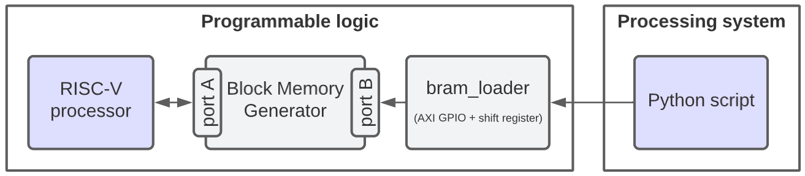
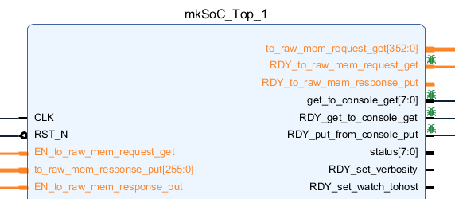
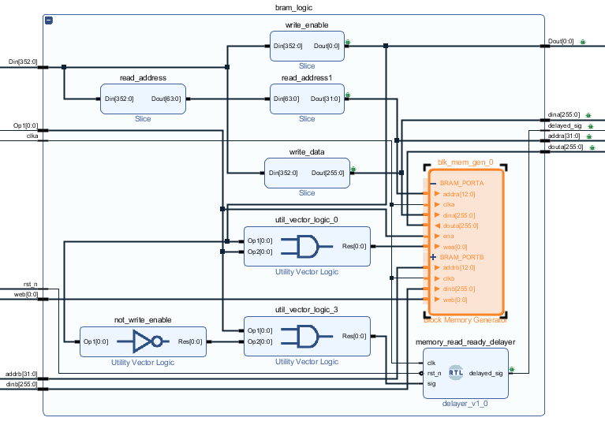
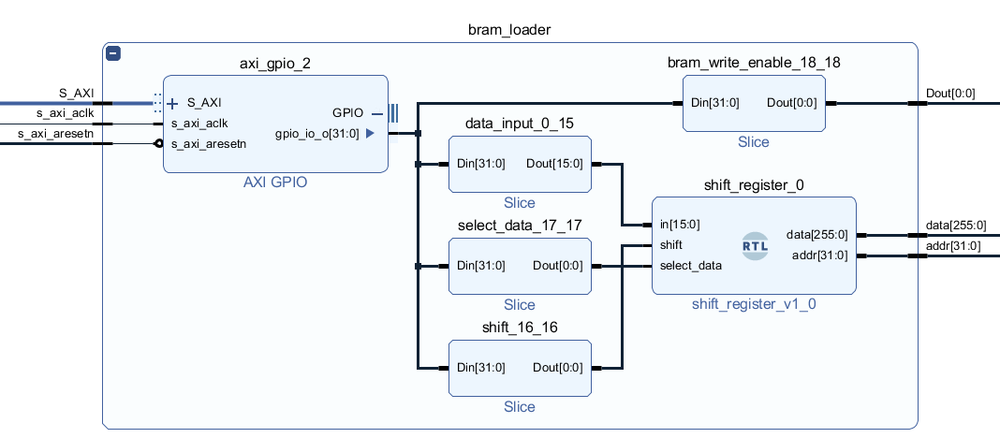
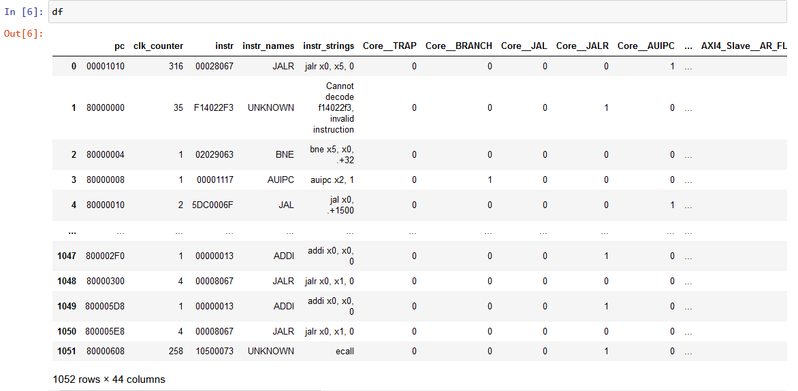

# Table of contents
- [Overview](#overview)
- [What is provided by the Flute itself for interacting with memory](#what-is-provided-by-the-flute-itself-for-interacting-with-memory)
- [How PYNQ wrapper is using what Flute provides](#how-pynq-wrapper-is-using-what-flute-provides)
    - [bram\_loader](#bram_loader)
- [Memory capacity](#memory-capacity)
    - [Potential memory capacity improvement](#potential-memory-capacity-improvement)
- [Compilation and file transfer to PYNQ board processing system](#compilation-and-file-transfer-to-pynq-board-processing-system)
- [Running the program](#running-the-program)
    - [What `run_and_collect` function is doing](#what-run_and_collect-function-is-doing)

# Overview
Simplified high level overview diagram: 



# What is provided by the Flute itself for interacting with memory
The SoC_Top.v module (generated from the [SoC_Top.bsv](https://github.com/bluespec/Flute/blob/master/src_Testbench/SoC/SoC_Top.bsv)) provided in the open source Flute processor contains the following signals to interact with memory:
* **to_raw_mem_request_get[352:0] (output)** of which:
  * bits 0-255 specify data to be written into memory
  * bit 352 acts as write enable signal
  * bits 256-319 specify address to be read
* **RDY_to_raw_mem_request_get (output)** indicates that reading or writing (depending on bit 352) should take place
* **RDY_to_raw_mem_response_put (output)** (unsure, but it either indicates the processor is ready to receive data from memory, or that it acknowledges just received data, currently in PYNQ wrapper it's not connected to anything)
* **to_raw_mem_response_put[255:0] (input)** data from memory
* **EN_to_raw_mem_request_get (input)** notifies the processor that reading/writing took place (in PYNQ wrapper design it is directly connected to `RDY_to_raw_mem_request_get`)
* **EN_to_raw_mem_response_put (input)** notifies the processor that the memory is outputting data (previously requested by the processor itself)




# How PYNQ wrapper is using what Flute provides
PYNQ wrapper contains Block Memory Generator that has 2 ports (each port allowing to write and read):
* **port A** - connected to Flute processor using signals mentioned above (allowing it to read/write data from/to memory, e.g. to read program instructions or push/pop data from stack etc.)
* **port B** - controllable from python, connected to PS through the `bram_loader` hierachical block, allowing to load a program binary into memory



### bram_loader
`bram_loader` hierarchical block allows the python script using PYNQ API to interact with the **port B** of the Block Memory Generator to upload a program into it. `bram_loader` contains AXI GPIO module and a shift register to overcome the 32-pin per channel limitation of the AXI GPIO module, thanks to shift register the `bram_loader` outputs 256 data, 32 bit address, and 1 bit write enable signal, all being supplied through only 19 bits of the AXI GPIO module.



The [bram_loader.py](../jupyter_notebooks/bram_loader.py) file contains a class that allows to interact with the `bram_loader` block. The code below is a part of [pynq_wrapper.ipynb](../jupyter_notebooks/pynq_wrapper.ipynb) and presents how that class is used to load a program into the Block Memory Generator.

```python
from bram_loader import Bram_Loader
bram_loader = Bram_Loader(base.bram_loader.axi_gpio_2) # base is the pynq Overlay
bram_loader.load('riscv-stack-mission.bin')
```

# Memory capacity
Currently the PYNQ wrapper uses [Block Memory Generator](https://www.xilinx.com/products/intellectual-property/block_memory_generator.html) module, having the capacity of around 256KB (8192 depth * 256-bit items / 8-bits per byte). That seems to be enough to store short programs and test the functionality of the continuous monitoring system implemented in the PYNQ wrapper.

### Potential memory capacity improvement
We could replace the Block Memory Generator with Memory Interface Generator in similar way to the [SSITH-P2-based design we tested](https://github.com/michalmonday/CheriBSD-on-minimal-hardware#block-design) which used it to control 1GB of DDR3 memory available from the PL of the ZC706 board.

# Compilation and file transfer to PYNQ board processing system
In our experiment we compiled the [modified version of the stack-mission.c](https://github.com/michalmonday/riscv-baremetal-minimal-example-c/blob/flute_design/stack-mission.c) program from [cheri-exercises](https://github.com/CTSRD-CHERI/cheri-exercises/blob/master/src/missions/uninitialized-stack-frame-control-flow/stack-mission.c) (modified to avoid using libraries).

We forked the [riscv-baremetal-minimal-example-c](https://github.com/michalmonday/riscv-baremetal-minimal-example-c/tree/flute_design). The stack-mission.c can be compiled by cloning that fork, switching to `flute_design` branch and running make in the `riscv-baremetal-minimal-example-c` directory.
```bash
git clone git@github.com:michalmonday/riscv-baremetal-minimal-example-c.git
cd riscv-baremetal-minimal-example-c
git checkout flute_design
make -f Makefile_gcc_stack_mission
```
The riscv-stack-mission.bin should appear in the directory. That file should be transferred to PYNQ board `design_files` directory (it is shown how to do it in the [PYNQ getting started guide](https://pynq.readthedocs.io/en/latest/getting_started/pynq_sdcard_getting_started.html#accessing-files-on-the-board)). After transferring the file to the board processing system, the python script will be able to access it and transfer it into programmable logic (into the Block Memory Generator through `bram_loader`)

# Running the program
To run the program, we first neet to load it into block ram memory and then use `run_and_collect` function. Code below is a part of [pynq_wrapper.ipynb](../jupyter_notebooks/pynq_wrapper.ipynb) code that runs the same program multiple times with different inputs and saves collected data in csv files.
```python
bram_loader.load(PATH / 'riscv-stack-mission.bin')

program_inputs = [
    "==AA==AA==-=-AA====-",
    "=",
    "AA=-==-AAAA-=AA",
    "=-=----AA=AA==AAAAAAAA",
    "--=AA==-AA-==AA-=",
    "AA-=AA=--",
    "AA=",
    "AAAAAA=",
    "-=-=",
    "AA--"
]

for i, stdin in enumerate(program_inputs):
    print(f'Running program with input: "{stdin}"')
    df, stdout = run_and_collect(stdin)
    csv_f_name = f'normal_{i}.csv'
    print(f'Collected {df.shape[0]} items. Saving as "{csv_f_name}"')
    df.to_csv(str(OUTPUT_DIR / csv_f_name), index=False)
    print()
```

### What `run_and_collect` function is doing
First it sets CPU into inactive state, then it reactivates `continuous_monitoring_system` (in case if it was stopped by previously encountered WFI instruction). Then it sends console input into a buffer just, this way it's ready immediately when program starts running. Then it resets CPU and starts the program. Finally it transfers all collected data from the buffer into a dataframe, which is returned with console output.

```python
def run_and_collect(stdin):
    # set CPU into inactive state (active-low reset is set LOW)
    gpio_rst_n_out.write(0)
    
    # activate continous_monitoring_system in case if it's stopped by previously 
    # encountered "wait for interrupt" (WFI) instruction
    cms_ctrl.reset_wfi_wait()
    
    # send standard input into a buffer, this way it will be ready
    # immediately after CPU starts running the program
    reset_console_input()
    console_send(stdin, end_byte=ord('\n')) # '\n' is hardcoded here specifically for "stack-mission.c" program
    
    #print(f'Fifo items count before {gpio_fifo_wr_count.read()}')
    reset_cpu()
    #print(f'Fifo items count after {gpio_fifo_wr_count.read()}')
    
    # transfer all collected data
    items_transferred = get_dma_transfer(input_buffer, dma_rec)#, dont_wait=True)
    
    # parse received data and turn it into pandas DataFrame
    events, events_overflows, pcs, clk_counters, instrs, instr_names, instr_strings = parse_last_dma_transfer(input_buffer, items_transferred)
    df = pd.DataFrame(zip(pcs,clk_counters,instrs,instr_names,instr_strings), columns=['pc','clk_counter','instr', 'instr_names', 'instr_strings'])    
    df['pc'] = df['pc'].apply(lambda x: f'{x:8X}')
    df['instr'] = df['instr'].apply(lambda x: f'{x:08X}')
    df_events = pd.DataFrame(events, columns=event_names)
    df = pd.concat([df, df_events], axis=1)
    stdout = console_read()
    return df, stdout
```

The returned DataFrame contains data like:

