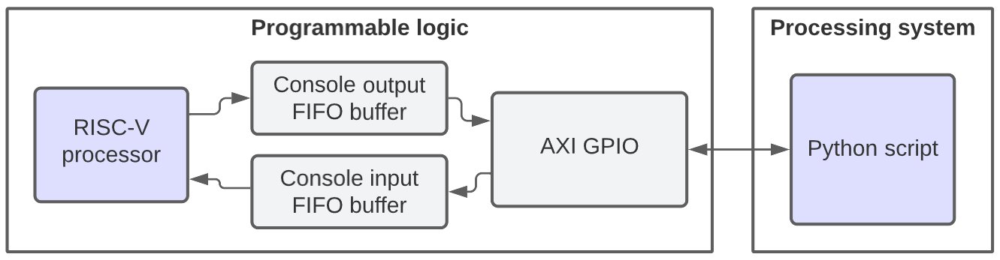
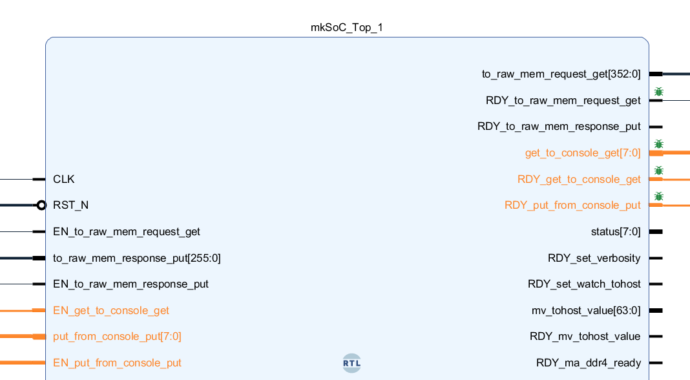
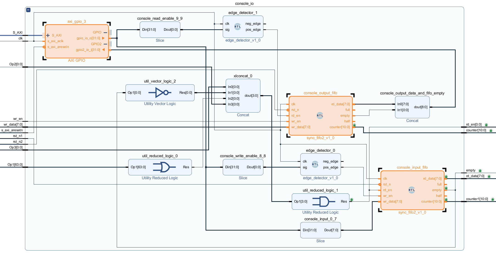

# Table of contents
- [Overview](#overview)
- [What is provided by the Flute itself for controlling console I/O](#what-is-provided-by-the-flute-itself-for-controlling-console-io)
- [How PYNQ wrapper is using what Flute provides](#how-pynq-wrapper-is-using-what-flute-provides)
- [Python code for controlling console I/O using PYNQ wrapper hardware](#python-code-for-controlling-console-io-using-pynq-wrapper-hardware)
    - [Independent reset signals for FIFO buffers](#independent-reset-signals-for-fifo-buffers)

# Overview
The diagram is simplified to show high level overview.  



# What is provided by the Flute itself for controlling console I/O

The SoC_Top.v module (generated from the [SoC_Top.bsv](https://github.com/bluespec/Flute/blob/master/src_Testbench/SoC/SoC_Top.bsv)) provided in the open source Flute processor contains handy signals for controlling console input/output.



Signals useful for console output are:
* **get_to_console_get[7:0]** (output) - output character value (e.g. 'H' in "Hello World!" program)
* **RDY_get_to_console_get** (output) - processor indicates that the program it runs outputted a character that is ready to be received by setting it HIGH
* **EN_get_to_console_get** (input) - external user (e.g. PYNQ wrapper) can notify the processor that the character was received by setting it HIGH, this way the processor will set `get_to_console_get[7:0]` to a new character to be outputted (e.g. 'e' in "Hello World!" program)

Signals useful for console input are:  
* **put_from_console_put[7:0]** (input) - input chatacter value set by the external user (e.g. PYNQ wrapper)
* **EN_put_from_console_put** (input) - indicates that the external user (e.g. PYNQ wrapper) set `put_from_console_put[7:0]` to a new character that will be received by the processor
* **RDY_put_from_console_put** (output) - processor indicates that it is ready to receive a new input character by setting it HIGH

# How PYNQ wrapper is using what Flute provides
In the PYNQ wrapper, console input and output is implemented by controlling the 3 processor inputs mentioned above while monitoring the 3 outputs. Additionally, the PYNQ wrapper uses 2 FIFO buffers, one to store output characters before these are read, and one to store input characters. Reading and writing into these buffers is accomplished by using AXI GPIO module together with signal edge detectors that ensure reading/writing is done for no longer than 1 clock cycle (despite not being able to control signals that quickly from python).



# Python code for controlling console I/O using PYNQ wrapper hardware

```python
def console_send(s, end_byte=None):
    ''' Uses AXI GPIO and hardware FIFOs. '''
    console_input = base.console_io.axi_gpio_3.channel1[0:8]
    console_write_enable = base.console_io.axi_gpio_3.channel1[8] # using "edge_detector" to avoid continuous writing
    console_write_enable.off()
    for c in s:
        console_input.write(ord(c))
        console_write_enable.on()
        console_write_enable.off()
    if end_byte is not None:
        console_input.write(end_byte)
        console_write_enable.on()
        console_write_enable.off()
    
def console_data_available():
    console_output_empty = base.console_io.axi_gpio_3.channel2[8]
    return console_output_empty.read() == 0

def console_read():
    ''' Uses AXI GPIO and hardware FIFOs. '''
    s = ''
    console_output = base.console_io.axi_gpio_3.channel2[0:8]
    console_read_enable = base.console_io.axi_gpio_3.channel1[9] # using "edge_detector" to avoid continuous reading
    console_read_enable.off()
    while console_data_available():
        s += chr(console_output.read())
        console_read_enable.on()
        console_read_enable.off()
    return s
```

### Independent reset signals for FIFO buffers
Both FIFO buffers have their dedicated reset signals. This is especially useful for input buffer, because it allows to fill it before starting/resetting the processor. This way any input characters will wait for it and be delivered immediately when they're expected. Otherwise the processor would have to wait until python line sending user input is executed, which would result in long repetitive program trace (due to waiting for user input). Sample code below resets both buffers.

```python
def reset_console_input(delay=0.001):
    gpio_rst_n_console_input.write(0)
    time.sleep(delay)
    gpio_rst_n_console_input.write(1)

def reset_console_output(delay=0.001):
    gpio_rst_n_console_output.write(0)
    time.sleep(delay)
    gpio_rst_n_console_output.write(1)
```


