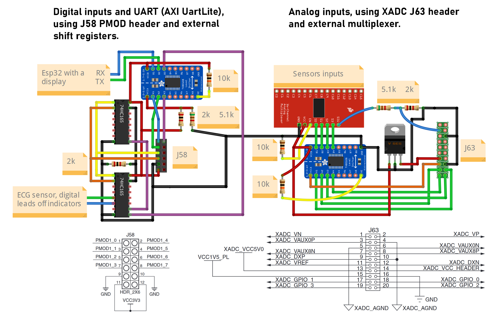
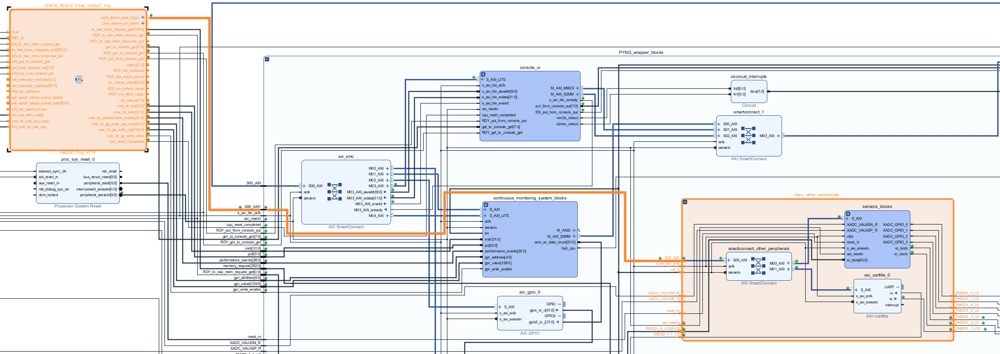
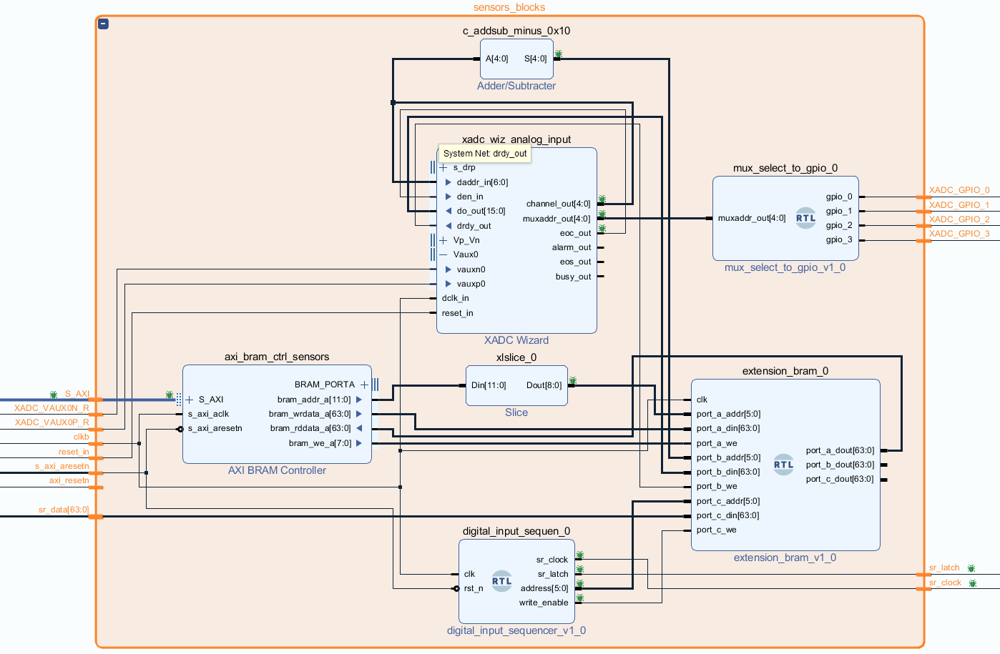

# Table of contents
- [Overview](#overview)
- [Components used](#components-used)
- [Wiring](#wiring)
- [Flute modification](#flute-modification)
- [How values are read in the RISC-V program](#how-values-are-read-in-the-risc-v-program)
- [Setup and Vivado implementation](#setup-and-vivado-implementation)
    - [Analog sensors](#analog-sensors)
    - [Intermediate sensor data storage](#intermediate-sensor-data-storage)
    - [Interconnect](#interconnect)
    - [Block diagram (XADC wizard and storage)](#block-diagram-xadc-wizard-and-storage)
    - [Digital sensors](#digital-sensors)

# Overview
Embedded systems often interact with the outside world through sensors and actuators. By default, the Flute processor does not seem to have support for interacting with such peripherals. We created a custom board with support for up to 16 analog inputs and 16 digital inputs, we modified the processor to allow reading their values. This way we can run programs on the Flute RISC-V that use sensor data, making it easy to disrupt their baseline behaviour, or emulate sensor failure for presentation purposes.


# Components used
* 7 sensors we selected from the [KEYESTUDIO 37 in 1](https://www.amazon.co.uk/keyestudio-Projects-Receiver-Tracking-Ultrasonic/dp/B07H7GRSD7/ref=sr_1_5) bundle:
    * Potentiometer
    * Light 
    * Humidity 
    * Vibration
    * Microphone
    * Hall sensor
    * Temperature 
* [AD8232](https://www.amazon.co.uk/gp/product/B08216YR9H) ECG sensor with [SKINTACT electrodes](https://www.amazon.co.uk/dp/B00D3O9NPI) (these electrodes are much better than the ones that come with the sensor)
* [CD74HC4067](https://www.amazon.co.uk/DollaTek-CD74HC4067-Channel-Multiplexer-Breakout/dp/B07PPKRVGW/ref=sr_1_6) multiplexer 
* 2x [TXS0108E (HW221)](https://www.amazon.co.uk/XTVTX-TXS0108E-Converter-Bi-Directional-Compatible/dp/B09P87R16M/ref=sr_1_8) logic level converter (for converting XADC_GPIO from 1.5V to 3.3V, and PMOD from 2.5V to 3.3V)
* 20-pin ribbon cable (for connecting the analog inputs to the J63 XADC connector on the ZC706 board)
* 12-pin ribbon cable (for connecting digital inputs to the J58 connector on the ZC706 board)
* 2x 5.1k, 2x 2k resitors (for voltage dividers because ZC706 board expects no more than 1V on the analog input pins, and the PMOD J58 header expects 2.5V inputs)
* 3x 10k (or similar) resistor (for pull-up of the level shifter output enable pin and pull-down of the multiplexer enable pin)
* 2x [SN74HC165N](https://www.amazon.co.uk/dp/B08LYS98RQ) shift registers (for reading digital inputs through only 3 pins of the ZC706 board)
* [Voltage regulator](https://www.amazon.co.uk/AMS1117-3-3-4-75V-12V-voltage-regulator-module/dp/B09Q8Q3ZVM/ref=sr_1_3), 5V to 3.3V (using 3.3V potentially allows to avoid using the level shifter when alternative 2.5V pins from J58 are used, but it is more elegant to just use the level shifter and keep all connections within the single ribbon cable)
* 2*10 header pins (it would be better to use a proper [20-pin socket](https://www.amazon.co.uk/sourcingmap%C2%AE-2-54mm-Socket-Straight-Connector/dp/B013FM9S2K/ref=sr_1_5) which enforces the right orientation and position of the ribbon cable, but we were to eager to make it work and didn't wait for the delivery)
* perfboard

# Wiring 



Notice that multiplexer EN is pulled down, while the OE pin of the level shifter is pulled up. Wiring of sensors is not shown in the diagram, their analog output pins go to the mutiplexer pins C0-C15. The J63 on the diagram signifies the header pins for the ribbon cable connector but correspond directly to the XADC_GPIO pins on the ZC706 board, the same applies to J58 representation. It can be noticed that only 2 pins of 16 inputs available are connected to the 74HC165 shift registers, we could connect them directly to J58 but this implementation allow easy expansion if more digital sources need to be read.


# Flute modification
Soc_Top.bsv is the top level synthesizable module of the Flute (there is also a higher-level `Top_HW_Side.bsv` module but it is for simulation only). It instantiates UART, memory controller and boot rom modules, all connected through the same fabric (interconnect) using AXI protocol. 

We modified that fabric to contain another port called `other_peripherals` (visible on diagram below as `core_dmem_post_fabric` as we also propagate the input of internal fabric called `core_dmem_pre_fabric` just in case if we wanted to monitor specific events of some internal modules on that bus). 

```verilog
// Part of the SoC_Map.bsv file:

   // ----------------------------------------------------------------
   // Other peripherals 0 (e.g. to be added in Vivado block design)

   let other_peripherals_addr_range = Range {
      base: 'hC000_3000,
      size: 'h0000_4000     
   };
```

```verilog
// Part of the Soc_Map.bsv file:

   // ----------------------------------------------------------------
   // I/O address predicate
   // Identifies I/O addresses in the Fabric.
   // (Caches need this information to avoid cacheing these addresses.)

   function Bool fn_is_IO_addr (Fabric_Addr addr);
      return (   inRange(near_mem_io_addr_range, addr)
              || inRange(plic_addr_range, addr)
              || inRange(uart0_addr_range, addr) 
              || inRange(other_peripherals_addr_range, addr)); // added line
   endfunction
```

To view all exact changes see the history of the [SoC_Map.bsv](https://github.com/michalmonday/Flute/commits/continuous_monitoring/src_Testbench/SoC/SoC_Map.bsv) and [Soc_Top.bsv](https://github.com/michalmonday/Flute/commits/continuous_monitoring/src_Testbench/SoC/SoC_Top.bsv) files.

# How values are read in the RISC-V program
A baremetal program can interact with any peripherals we add to the design (e.g. analog sensor inputs) by reading or writing to address range specified in [SoC_Map.bsv](https://github.com/michalmonday/Flute/blob/continuous_monitoring/src_Testbench/SoC/SoC_Map.bsv) file.

For example, a program can read potentiometer and light sensor values by using the following snippet:
```cpp
static volatile long *sensors = (long*)0xC0003000;
static volatile long *digital_inputs = (long *)(long *)(0xC0003000 + (sizeof(long) * 16));

int main() {
    long potentiometer_value = sensors[0];
    long light_value = sensors[1];

    char first_pin = digital_inputs[0];
    char second_pin = digital_inputs[1];
    return 0;
}
```

# Setup and Vivado implementation

### Analog sensors
In the pynq wrapper design the XADC wizard has the "external multiplexer" setting enabled. This means that the XADC wizard will output "muxaddr_out" signal, letting know the physically connected external multiplexer which input channel (which sensor) to select. The "muxaddr_out" is a 4-bit signal, so the multiplexer can select up to 16 different sensors. 

The currently selected input travels to the FPGA through XADC_VAUX0P pin (while XADC_VAUX0N is connected to ground, for the purpose of reducing noise by subtracting the ground voltage from the XADC_VAUX0P signal). XADC_GPIO pins 0-3 are connected to the multiplexers address pins (through the level shifter to raise their voltage from 1.5V to 3.3V). The image below shows their state during operation:


It can be noticed that the address never goes above 6, that is because in the XADC wizard I selected only 7 inputs to be used in the channel sequencer (because the extension board only had 7 sensors as of 26/02/2023).  


The lowest possible conversion rate was selected (39 KSPS, while using 50MHz clock), because initially with the highest one the mutliplexer didn't work well.

### Intermediate sensor data storage 
The output of the XADC wizard (do_out pin) is connected to the small 32x64-bit memory ([extension_bram.v](../vivado_files/src_verilog/custom_hdl/extension_bram.v)) dedicated for storing sensor values. That memory has 3 ports:
* port a - it is controlled by the RISC-V processor, it can be used to read or write to the memory (currently it is only used for reading)
* port b - it is constantly updating the memory with up to 16 of the latest analog sensor values (as many as the XADC wizard was set to use)
* port c - it is constantly updating the memory with up to 16 of the latest digital sensor values (the number of digital sensors is a generic parameter of the [digital_input_sequencer.v](../vivado_files/src_verilog/custom_hdl/digital_input_sequencer.v), which relies on 2 cascaded shift registers.

:warning: Using memory with 3 write ports and not using BRAM may be considered not good practice (inefficient) as mentioned in [this stackexchange answer](https://electronics.stackexchange.com/a/50975), however in this case memory is rather small so it shouldn't be a big issue, although possibly it would be more elegant to use separate memories for analog and digital sensors, each with a one or two write ports, and utilizing BRAM (but "if it works, it works").

### Interconnect
Diagram below shows the newly created output (of the internal Soc_Top fabric) connected to BRAM controller (through smartconnect block used for the sake of address translation, it is set to start at address `0xC0003000` in address editor to match with Soc_Map.bsv definition).



### Block diagram (XADC wizard and storage)
It can be noticed that the slice component is used between the BRAM controller and the memory, this is because the BRAM controller does not anticipate that the memory is item-addressable, it expects that the memory is byte-addressable, which isn't the case. For that reason the address is divided by 8 (by shifting the address 3 bits to the right using the slice block).




### Digital sensors
The setup used in this project allows to read 16 digital inputs through a single wire thanks to using 2 cascaded SN74HC165N shift registers controlled by the [digital_input_sequencer.v](../vivado_files/src_verilog/custom_hdl/digital_input_sequencer.v). The sequencer controls the "sr_latch" and "sr_clock" pins that determine which digital input is currently supplied to the board. It also controls the "address" and "write_enable" pins that let the input value to update memory location corresponding to it.