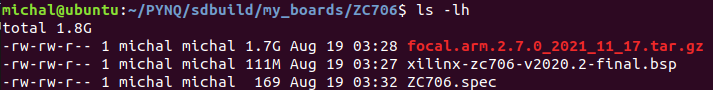
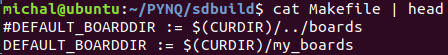

# Table of contents
- [Overview](#overview)
- [Prerequisites](#prerequisites)
- [Setup steps](#setup-steps)
  - [Build and flash PYNQ image SD card](#build-and-flash-pynq-image-sd-card)
    - [Potential issues with compilation](#potential-issues-with-compilation)
  - [Insert SD card into ZC706 board and adjust switches](#insert-sd-card-into-zc706-board-and-adjust-switches)
  - [Copy files to PYNQ](#copy-files-to-pynq)
  - [Install additional python libraries on PYNQ](#install-additional-python-libraries-on-pynq)
  - [Create Vivado project](#create-vivado-project)
  - [Modifying and recompiling the Flute processor](#modifying-and-recompiling-the-flute-processor)
  - [Simulating our program binary running on the modified processor](#simulating-our-program-binary-running-on-the-modified-processor)
    - [Specifying program path](#specifying-program-path)
    - [Simulation length](#simulation-length)
    - [Side note](#side-note)

# Overview
This guide describes how to prepare and/or compile all components involved in the whole PYNQ wrapper project, like:
* **PYNQ image** that has to be compiled and flashed into SD card.
* Modified **Flute RISC-V** processor, that propagates relevant signals, allowing them to be collected by external modules.
* **Vivado block design** that includes RISC-V processor, PYNQ wrapper modules, and processing system configuration.
* **Python files** that interacts with and controls the programmable logic modules (including RISC-V processor) and must be placed on the PYNQ filesystem.

# Prerequisites
* PYNQ board (e.g. ZC706) with at least 100k logic cells in programmable logic (e.g. Ultra96-V2 is not suitable)
* SD card to hold PYNQ image
* Host PC with Ubuntu 18.04 for compiling Flute processor (from Bluespec Verilog into Verilog) and building PYNQ SD card image for ZC706 (unless different board for which prebuilt image is available on [PYNQ website](http://www.pynq.io/board.html))

# Setup steps

## Build and flash PYNQ image SD card
We used 2.7.0 version of PYNQ, however as of 11/01/2023 a new version (3.0.0) is available. Notice that the 3.0.0 version requires different versions of Vivado, Vitis and petalinux (2022.1, as shown in [this updated guide](https://pynq.readthedocs.io/en/v3.0.0/pynq_sd_card.html#use-existing-ubuntu-os)) as opposed to 2.7.0 version that requires 2020.2 versions. I suggest to use v2.7.0 PYNQ and 2020.2 Xilinx versions when following this project.

Follow the steps listed in the [PYNQ SD Card image guide](https://pynq.readthedocs.io/en/v2.7.0/pynq_sd_card.html#use-existing-ubuntu-os). This isn't very straightforward at first look, you may have to:

Download v2.7.0 tag of the PYNQ repository, install packages and prepare new boards directory (to avoid compiling all default ones)
```bash
git clone --depth 1 --branch v2.7.0 git@github.com:Xilinx/PYNQ.git
./PYNQ/sdbuild/scripts/setup_host.sh # this will install required packages
cd PYNQ/sdcard
mkdir -p my_boards/ZC706
```


3 files will have to be put in the my_boards/ZC706/ directory:  
* [ZC706.spec](../setup_files/ZC706.spec) 
* **ZC706 BSP** image file (dated Nov 24 2020, MD5 sum value: b85bd68aed4146fce03e746eac89e0ab) from the [Petalinux tab](https://www.xilinx.com/support/download/index.html/content/xilinx/en/downloadNav/embedded-design-tools/archive.html) (2020.2 version from archive), ([direct downlad link](https://www.xilinx.com/member/forms/download/xef.html?filename=xilinx-zc706-v2020.2-final.bsp))
* [PYNQ rootfs arm v2.7](http://www.pynq.io/board.html) ([direct downlad link](https://bit.ly/pynq_arm_2_7))

In my case the contents of the `PYNQ/sdcard/my_boards/ZC706` directory are as follows: 



Prepare environment (requires Vivado, Vitis and petalinux 2020.2 versions to be installed):
```bash
# I have them installed in home/michal/ directory so "~" is used
source ~/Xilinx/Vitis/2020.2/settings64.sh
source ~/petalinux/settings.sh
```

Then to create the image we could run make like:
```bash
make BOARDDIR=/home/michal/PYNQ/sdcard/my_boards
```
I'm not sure why I didn't do that and modified Makefile instead (possibly it was compiling all boards from `PYNQ/boards`, can't remember) and ran `make` without BOARDDIR argument. I commented out the first line and added a modified line underneath (specifying `my_boards` directory).



### Potential issues with compilation
I encountered [this issue](https://discuss.pynq.io/t/gordian-knot-make-gcc-multilib-vs-gcc-arm-linux-gnueabihf/2791/2) and [this issue](https://discuss.pynq.io/t/error-during-creation-of-pynq-sd-related-to-gcc-mb-build/3112). What helped was removing all files/folders from `PYNQ/sdcard/build/gcc-mb` except `.build` directory (hidden because it starts with a dot), note that these folders/files may only exist after the error happens (so don't try to delete them before encountering the same error). Then downloading [expat.2.4.1.tar.bz2](https://discuss.pynq.io/t/error-during-creation-of-pynq-sd-related-to-gcc-mb-build/3112) and [isl-0.20.tar.gz](http://mirror.sobukus.de/files/src/isl/) and placing them in `PYNQ/sdcard/build/gcc-mb/.build/tarballs/` directory. After that running make worked well.

The compilation takes a lot of time (few hours), but eventually it should output the image file into `PYNQ/sdcard/output/ZC706/` directory. Then we can flash the SD card with the image file using a program like [Etcher](https://www.balena.io/etcher/) or [Rufus](https://rufus.ie).

## Insert SD card into ZC706 board and adjust switches

Set the SW11 - "boot mode select" DIP switch into the `00110` position (boot from SD card).

 

More details about this switch can be found in the [ZC706 User Guide](https://docs.xilinx.com/v/u/en-US/ug954-zc706-eval-board-xc7z045-ap-soc) page.

## Copy files to PYNQ
Copy [design_files](../design_files/) and [jupyter_notebooks](../jupyter_notebooks/) directories to the board.
[PYNQ getting started guide](https://pynq.readthedocs.io/en/latest/getting_started/pynq_sdcard_getting_started.html#accessing-files-on-the-board) describes how to access and upload files to the board. 

## Install additional python libraries on PYNQ
As of 11/01/2023, the only additional library used by the [pynq_wrapper_for_flute.ipynb](../jupyter_notebooks/pynq_wrapper_for_flute.ipynb) code is called `riscv-model`.
Normally installing python libraries is straightforward, but ZC706 doesn't have internet connectivity by default so installing libraries requires additional step. First we download the `.whl` file on a separate PC (with internet connection):  

```bash
# riscv-model library is used by the pynq_wrapper_for_flute.ipynb to decode instructions
python3 -m pip download riscv-model -d .
```
Then we copy it to the board and install it with:
```bash
# we can run this command from COM port console, or by opening new terminal in the jupyter notebook
python3 -m pip install <file>.whl -f ./ --no-index
```

## Create Vivado project
For the PYNQ wrapper design itself (not for building SD card) we used 2020.1 Vivado (instead of 2020.2) because initially we started with 2.6 version of PYNQ.

Create a new project targetting ZC706 board. Import all source files from [vivado_files](../vivado_files/src_verilog/) including files from all subdirectories. In the tcl console type `source "<absolute path to imported_design.tcl file>"`  to import the design. Then in the sources tab, right click on block design and click `Create HDL wrapper`. Then right click on the wrapper (that should appear 1 line above) and click `Set as Top`.

Then it should be able to select "Generate Bitstream" to generate the bistream file (which can be transferred to processing system and used by python script to load our hardware desingn into programmable logic).


## Modifying and recompiling the Flute processor
We used [CTSRD-CHERI](https://github.com/CTSRD-CHERI/Flute) version of Flute which we forked and modified (to propagate signals using ContinuousMonitoringSystem_IFC). The forked version is available a [this link](https://github.com/michalmonday/Flute/tree/continuous_monitoring/), modifications were done in the `continous_monitoring` branch (`git checkout continuous_monitoring`).

The [README.md]() of the Flute repository (including CHERI fork and my fork) contains instructions on how to build the processor. The main steps are as follows:
* Install [bsc](https://github.com/B-Lang-org/bsc) compiler.
* Install libraries for bsc compiler from [bsc-contrib](https://github.com/B-Lang-org/bsc-contrib) as described in bsc-contrib README.md file. Make sure to use PREFIX that will lead to bsc compiler. In my case, after installing libraries, the `bsc/bsc-2022.01-ubuntu-18.04/lib/Libraries/` directory contains all folders from [bsc-contrib/Libraries/](https://github.com/B-Lang-org/bsc-contrib/tree/main/Libraries) (e.g. Bus, COBS, FPGA).
* Navigate to `builds/RV64ACDFIMSUxCHERI_Flute_verilator` directory and run `make compile` to produce Verilog files (stored in `Verilog_RTL` directory) from Bluespec files.


## Simulating our program binary running on the modified processor

Following the next steps will simulate the processor running our program but without being connected to any external circuitry of PYNQ wrapper. Using this simulation can be helpful when trying to test/debug processor modifications, before attempting to connect them to any external modules like `continuous_monitoring_system`.

### Specifying program path
We can hardcode program full path in the `builds/Resources/Include_Common.mk` file (by setting EXAMPLE variable):


Note that this is a path to the ELF file, not the `.bin` (both are produced during compilation as it is described in the [loading_and_running_programs.md](./loading_and_running_programs.md) file).

```bash
cd builds/RV64ACDFIMSUxCHERI_Flute_verilator
make compile simulator && ./run_example.sh && gtkwave vcd/vlt_dump.vcd
```

We may then click `File -> Read Save File` and select signals.gtkw (which will populate waveform window with signals I checked while testing CPU modifications and trying to understand how it works in general). It should then display something like this:  


### Simulation length
Note that the simulation lasts 1500 clock cycles thanks to the [sim_main.cpp](https://github.com/michalmonday/Flute/blob/continuous_monitoring/builds/Resources/Verilator_resources/sim_main.cpp) file modification (it is crudely modified, but it works for this specific purpose).  

### Side note
Instead of hardcoding program path as `EXAMPLE` value in the `Resources/Include_Common.mk` and running `./run_example.sh` script, we could execute `make run_example EXAMPLE=<path>` which would probably be a more elegant way to do the same thing.


