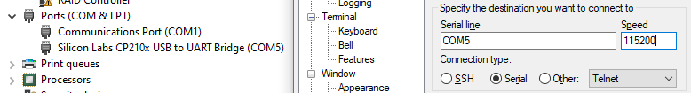

# Table of contents
- [Overview](#overview)
- [Prerequisites](#prerequisites)
- [Setup steps](#setup-steps)
  - [Download precompiled 2.7.0 PYNQ image for ZC706 board or build one](#download-precompiled-270-pynq-image-for-zc706-board-or-build-one)
    - [Precompiled image](#precompiled-image)
    - [Steps to build PYNQ image for ZC706](#steps-to-build-pynq-image-for-zc706)
    - [Potential issues with compilation](#potential-issues-with-compilation)
  - [Insert SD card into ZC706 board and adjust switches](#insert-sd-card-into-zc706-board-and-adjust-switches)
  - [Copy files to PYNQ](#copy-files-to-pynq)
  - [Install additional python libraries on PYNQ](#install-additional-python-libraries-on-pynq)
    - [Accessing console port (using putty)](#accessing-console-port-using-putty)
  - [Create Vivado project](#create-vivado-project)
  - [Modifying and recompiling the Flute processor](#modifying-and-recompiling-the-flute-processor)
  - [Simulating our program binary running on the modified processor](#simulating-our-program-binary-running-on-the-modified-processor)
    - [Specifying program path](#specifying-program-path)
    - [Simulation length](#simulation-length)
    - [Side note](#side-note)
  - [Connecting to the Jypyter Notebook server from the host PC](#connecting-to-the-jypyter-notebook-server-from-the-host-pc)
    - [Connecting through router (allows ZC706 PS to use internet)](#connecting-through-router-allows-zc706-ps-to-use-internet)
    - [Direct connection (won't allow ZC706 PS to use internet, so it's not recommended)](#direct-connection-wont-allow-zc706-ps-to-use-internet-so-its-not-recommended)

# Overview
This guide describes how to prepare and/or compile most components involved in the whole PYNQ wrapper project, like:
* **PYNQ image** for ZC706 board that has to be compiled and flashed into SD card.
* Modified **Flute RISC-V** processor, that propagates relevant signals, allowing them to be collected by external modules.
* **Vivado block design** that includes RISC-V processor, PYNQ wrapper modules, and processing system configuration.
* **Python files** that interacts with and controls the programmable logic modules (including RISC-V processor) and must be placed on the PYNQ filesystem.

Since February 2023, the PYNQ wrapper uses a custom extension board (connected to XADC port) to collect up to 16 analog inputs and read them in RISC-V programs. The extension board is not required to run the PYNQ wrapper, lack of it will not result in any errors. To build the extension board see the list part and the wiring diagram from [sensors_extension.md](sensors_extension.md) file.

Please note that this project is constantly under development, so files and documentation may not be fully updated at all times. If you are planning to follow this guide, please contact me and I will update it with the most recent files (email: mb19424@essex.ac.uk, discord:michalmonday#3687).

# Prerequisites
* PYNQ board (e.g. ZC706) with at least 100k logic cells in programmable logic (e.g. Ultra96-V2 is not suitable)
* SD card to hold PYNQ image
* Host PC with Ubuntu 18.04 for compiling Flute processor (from Bluespec Verilog into Verilog) and building PYNQ SD card image for ZC706 (unless different board for which prebuilt image is available on [PYNQ website](http://www.pynq.io/board.html))

# Setup steps

## Download precompiled 2.7.0 PYNQ image for ZC706 board or build one

We used 2.7.0 version of PYNQ, however as of 11/01/2023 a new version (3.0.0) is available. Notice that the 3.0.0 version requires different versions of Vivado, Vitis and petalinux (2022.1, as shown in [this updated guide](https://pynq.readthedocs.io/en/v3.0.0/pynq_sd_card.html#use-existing-ubuntu-os)) as opposed to 2.7.0 version that requires 2020.2 versions. I suggest to use v2.7.0 PYNQ and 2020.2 Xilinx versions when following this guide. Prebuilt image for ZC706 board is not available on the PYNQ website, so it has to be compiled.

### Precompiled image
I compiled the 2.7.0 version for the ZC706 board and uploaded it to Google Drive. It is available at the link below:
https://drive.google.com/file/d/1ieKwj0o5VDYzU0CycIzul4IUF5pB3oO5/view?usp=share_link

It takes a lot of space, there is no guarantee it will be available in the future, below I describe how to build it.

### Steps to build PYNQ image for ZC706
I found steps listed in the [PYNQ SD Card image guide](https://pynq.readthedocs.io/en/v2.7.0/pynq_sd_card.html#use-existing-ubuntu-os) to be not very straightforward and I encountered many issues trying to compile the image, so below I describe the steps that worked for me. The steps are as follows:  

Download v2.7.0 tag of the PYNQ repository, install packages and prepare the boards directory (to avoid compiling all default ones).
```bash
git clone --depth 1 --branch v2.7.0 git@github.com:Xilinx/PYNQ.git
./PYNQ/sdbuild/scripts/setup_host.sh # this will install required packages

# setup_host.sh suggests to logout/login after it completes

cd PYNQ/boards
# delete all boards to avoid compiling them 
git rm -r ZCU104/ Pynq-Z1/ Pynq-Z2/
mkdir ZC706
cd ZC706
# download ZC706.spec file from this repository 
wget https://raw.githubusercontent.com/michalmonday/pynq_wrapper/master/setup_files/ZC706.spec
```

Now manually download the ZC706 BSP image file into `PYNQ/boards/ZC706/` (the BSP file is dated Nov 24 2020 and has MD5 sum value: b85bd68aed4146fce03e746eac89e0ab) from the [Petalinux tab](https://www.xilinx.com/support/download/index.html/content/xilinx/en/downloadNav/embedded-design-tools/archive.html) on Xilinx website (choose Petalinux 2020.2 version from archive).

Now commit changes locally, this step is necessary because PYNQ weirdly clones the repository again before compilation, ignoring our changes unless a fresh commit is made (not sure why is that but that is very problematic, because otherwise we'd compile multiple boards for hours just to find out compilation fails due to lack of license to compile a board we're not even interested in compiling).

```bash
# navigate back to PYNQ
cd ../../
git add .
git commit -m "Removed all boards + added ZC706"
```

Prepare environment (requires Vivado, Vitis and petalinux to be installed, all being 2020.2 versions):
```bash
cd sdbuild
# I have them installed in home/michal/ directory so "~" is used in my case
source ~/Xilinx/Vitis/2020.2/settings64.sh
source ~/petalinux/settings.sh
```

Download the following 2 files into any path (e.g. `/home/michal/Downloads/pynq_zc706_sd_image_files`)
* [PYNQ rootfs arm v2.7](http://www.pynq.io/board.html) ([direct downlad link](https://bit.ly/pynq_arm_2_7)) - after downloading, it will be called `focal.arm.2.7.0_2021_11_17.tar.gz`  
* [Prebuilt PYNQ source distribution binary v2.7](http://www.pynq.io/board.html) ([direct download link](https://bit.ly/pynq_binary_v2_7)) - after downloading, it will be called `pynq-2.7.0.tar.gz`  

Then run the following command (with absolute paths to previously downloaded files, make sure to change `michal` into your username) to finally generate the sd card image:
```bash
# this is a single long command (in case if it appears to be few lines)
make BOARDDIR=/home/michal/PYNQ/boards BOARDS=ZC706 PREBUILT=/home/michal/Downloads/pynq_zc706_sd_image_files/focal.arm.2.7.0_2021_11_17.tar.gz PYNQ_SDIST=/home/michal/Downloads/pynq_zc706_sd_image_files/pynq-2.7.0.tar.gz 
```

The compilation takes some time, but eventually it should output the image file into `PYNQ/sdbuild/output/ZC706/` directory (the image file is quite large, around 7GB size). Then we can flash the SD card with the image file using a program like [Etcher](https://www.balena.io/etcher/) or [Rufus](https://rufus.ie).

### Potential issues with compilation
It probably shouldn't happen if you follow steps above, but while trying to figure out how to compile the sd card image (using slightly different commands) I encountered [this issue](https://discuss.pynq.io/t/gordian-knot-make-gcc-multilib-vs-gcc-arm-linux-gnueabihf/2791/2) and [this issue](https://discuss.pynq.io/t/error-during-creation-of-pynq-sd-related-to-gcc-mb-build/3112). What helped was removing all files/folders from `PYNQ/sdbuild/build/gcc-mb` except `.build` directory (hidden because it starts with a dot), note that these folders/files may only exist after the error happens (so don't try to delete them before encountering the same error). Then download [expat.2.4.1.tar.bz2](https://discuss.pynq.io/t/error-during-creation-of-pynq-sd-related-to-gcc-mb-build/3112) and [isl-0.20.tar.gz](http://mirror.sobukus.de/files/src/isl/) and place them in `PYNQ/sdbuild/build/gcc-mb/.build/tarballs/` directory. After that running `make` should fix these problems.


## Insert SD card into ZC706 board and adjust switches

Set the SW11 - "boot mode select" DIP switch into the `00110` position (boot from SD card).

 

More details about this switch can be found in the [ZC706 User Guide](https://docs.xilinx.com/v/u/en-US/ug954-zc706-eval-board-xc7z045-ap-soc) page.

## Copy files to PYNQ
Copy [design_files](../design_files/) and [jupyter_notebooks](../jupyter_notebooks/) directories to the board.
[PYNQ getting started guide](https://pynq.readthedocs.io/en/latest/getting_started/pynq_sdcard_getting_started.html#accessing-files-on-the-board) describes how to access and upload files to the board. 

## Install additional python libraries on PYNQ

Access PYNQ terminal (either through [COM port](#accessing-console-port-using-putty) or [Jupyter notebook](#connecting-to-the-jypyter-notebook-server-from-the-host-pc)). Use `sudo su -` if the terminal is accessed through COM port to become root user (otherwise python packages can't be installed, by default the COM port is interacting as `xilinx` user). 

<!-- First we may update the pip:
```bash
python3 -m pip install pip --upgrade
```

The [pynq_wrapper.ipynb]() uses only 1 additional python library called `riscv-model`. We can install it with:
```bash
python3 -m pip install riscv-model
``` -->

Simply using pip didn't work, I had to install some packages through apt:
```bash
# (not sure if ninja-build, python-sklearn-doc and python3-sklearn-pandas are needed)
sudo apt install ninja-build python3-scipy python3-sklearn python3-sklearn-lib python-sklearn-doc python3-sklearn-pandas
```

Then we can copy the [requirements_pynq_2_7_0.txt](../requirements_pynq_2_7_0.txt) file to the board and install all the libraries with:
```bash
python3 -m pip install -r requirements_pynq_2_7_0.txt
```

Installing packages may take long time, sometimes without receiving any verbose messages, so we may want to run `htop` from a separate terminal to reassure that it didn't hang (or use -v, -vv or -vvv arguments to `pip install` command that enable increasing levels of verbosity).

<!-- 

~~As of 11/01/2023, the only additional library used by the [pynq_wrapper.ipynb](../jupyter_notebooks/pynq_wrapper.ipynb) code is called `riscv-model`.
Normally installing python libraries is straightforward, but ZC706 doesn't have internet connectivity by default so installing libraries requires additional step. First we download the `.whl` file on a separate PC (with internet connection):~~

```bash
# riscv-model library is used by the pynq_wrapper.ipynb to decode instructions
python3 -m pip download riscv-model -d .
```
~~Then we copy it to the board and install it with: ~~
```bash
# we can run this command from COM port console, or by opening new terminal in the jupyter notebook
python3 -m pip install <file>.whl -f ./ --no-index
``` -->

### Accessing console port (using putty)

We can check in device manager the com port number (in my case it was COM5), and use it in putty to access the serial port (baud rate is set to 115200).

  

Then we can use the console port to install python libraries (as described above).


## Create Vivado project
For the PYNQ wrapper design itself (not for building SD card) we used 2020.1 Vivado (instead of 2020.2) because initially we started with 2.6 version of PYNQ.

Create a new project targetting ZC706 board. Import all source files from [vivado_files](../vivado_files/src_verilog/) including files from all subdirectories. In the tcl console type `source "<absolute path to imported_design.tcl file>"`  to import the design. Then in the sources tab, right click on block design and click `Create HDL wrapper`. Then right click on the wrapper (that should appear 1 line above) and click `Set as Top`.

Then it should be able to select "Generate Bitstream" to generate the bistream file (which can be transferred to processing system and used by python script to load our hardware desingn into programmable logic).

We can put [copy_to_pynq.py](../vivado_files/copy_to_pynq.py) in the root directory of the Vivado project to ease copying `.bit` and `.hwh` files into `design_files` on the PYNQ. We can run it like:
```bash
py -3 copy_to_pynq.py imported_design
```
Where `imported_design` stands for the name of the block design.

## Modifying and recompiling the Flute processor
We used [CTSRD-CHERI](https://github.com/CTSRD-CHERI/Flute) version of Flute which we forked and modified (to propagate signals using ContinuousMonitoringSystem_IFC). The forked version is available a [this link](https://github.com/michalmonday/Flute/tree/continuous_monitoring/), modifications were done in the `continous_monitoring` branch (`git checkout continuous_monitoring`).

The [README.adoc](https://github.com/bluespec/Flute/blob/master/README.adoc) of the Flute repository (including CHERI fork and my fork) contains most instructions on how to build the processor (however the PYNQ wrapper requires slightly modified version of bsc compiler as described below). The main steps are as follows:
* Compile bsc compiler from [this fork](https://github.com/michalmonday/bsc), [this page](https://github.com/michalmonday/bsc/blob/main/INSTALL.md) explains how to do it. After compilation add the newly created `bsc/inst/bin` directory to the PATH environment variable. Compiling from source is required because the default RegFile module (used to implement general purpose registers in the Flute processor) does not allow simultaneous read access to sufficient number of registers (in other words, modifying and recompiling bsc allows to continuously monitor A0-A4 registers that are traced by PYNQ wrapper as of 28/02/2023).
* Install libraries for bsc compiler from [bsc-contrib](https://github.com/B-Lang-org/bsc-contrib) as described in bsc-contrib README.md file. Make sure to use PREFIX that will lead to bsc compiler. In my case, after installing libraries, the `bsc/lib/Libraries/` directory contains all folders from [bsc-contrib/Libraries/](https://github.com/B-Lang-org/bsc-contrib/tree/main/Libraries) (e.g. Bus, COBS, FPGA).
* Navigate to `Flute/builds/RV64ACDFIMSUxCHERI_Flute_verilator` directory and run `make compile` to produce Verilog files (stored in `Verilog_RTL` directory) from Bluespec files.


## Simulating our program binary running on the modified processor

Following the next steps will simulate the processor running our program but without being connected to any external circuitry of PYNQ wrapper. Using this simulation can be helpful when trying to test/debug processor modifications, before attempting to connect them to any external modules like `continuous_monitoring_system`.

### Specifying program path
We can hardcode program full path in the `builds/Resources/Include_Common.mk` file (by setting EXAMPLE variable):


Note that this is a path to the ELF file, not the `.bin` (both are produced during compilation as it is described in the [loading_and_running_programs.md](./loading_and_running_programs.md) file).

```bash
cd builds/RV64ACDFIMSUxCHERI_Flute_verilator
make compile simulator && ./run_example.sh && gtkwave vcd/vlt_dump.vcd
```

We may then click `File -> Read Save File` and select signals.gtkw (which will populate waveform window with signals I checked while testing CPU modifications and trying to understand how it works in general). It should then display something like this:  


### Simulation length
Note that the simulation lasts 1500 clock cycles thanks to the [sim_main.cpp](https://github.com/michalmonday/Flute/blob/continuous_monitoring/builds/Resources/Verilator_resources/sim_main.cpp) file modification (it is crudely modified, but it works for this specific purpose).  

### Side note
Instead of hardcoding program path as `EXAMPLE` value in the `Resources/Include_Common.mk` and running `./run_example.sh` script, we could execute `make run_example EXAMPLE=<path>` which would probably be a more elegant way to do the same thing.


## Connecting to the Jypyter Notebook server from the host PC

To run and control the python script we may (but don't have to) use a separate "host" PC that can access the Jupyter Notebook server created by the PYNQ system running on the PS of the ZC706 board.

### Connecting through router (allows ZC706 PS to use internet)
We can connect the ZC706 board to the router using Ethernet cable. It should be assigned an IP by the router, which we can check by going into router configuration page and checking connected clients (e.g. on my network it's `192.168.0.1`). Then we should be able to access the jupyter server by going into browser and navigating to: `<router_ip>:9090/` (e.g. `192.168.0.103:9090` on my network). The default password to Jupyter Notebook is `xilinx`. After login, it should look like this:  


Initially I had problems accessing ZC706 board that is connected to the router, for that reason there's a separate section for this case ([Direct connection](#direct-connection-wont-allow-zc706-ps-to-use-internet-so-its-not-recommended)), but using it won't allow to install required python libraries. Recently I tried connecting through router again and it just worked well (allowing to mitigate the problematic offline package installation).


### Direct connection (won't allow ZC706 PS to use internet, so it's not recommended)


For direct connection we can connect the Ethernet cable to both ends (host PC, ZC706 board) and assign a static IP on the host PC. I used Windows to do this, and followed the [PYNQ - Assign a static IP guide](https://pynq.readthedocs.io/en/v2.7.0/appendix/assign_a_static_ip.html). These are settings I used:


Where 192.168.2.98 is the IP of the host PC (Windows) and the 192.168.2.99 is the IP of the PYNQ system running on PS of the ZC706 board. After powering on the board it should take a minute or two before the Jupyter Notebook can be accessed by going into browser and navigating to: `192.168.2.99:9090/`. 