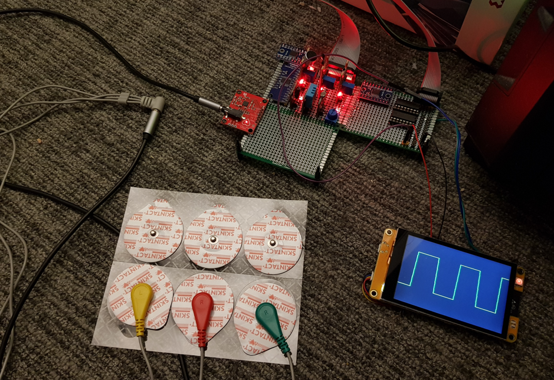
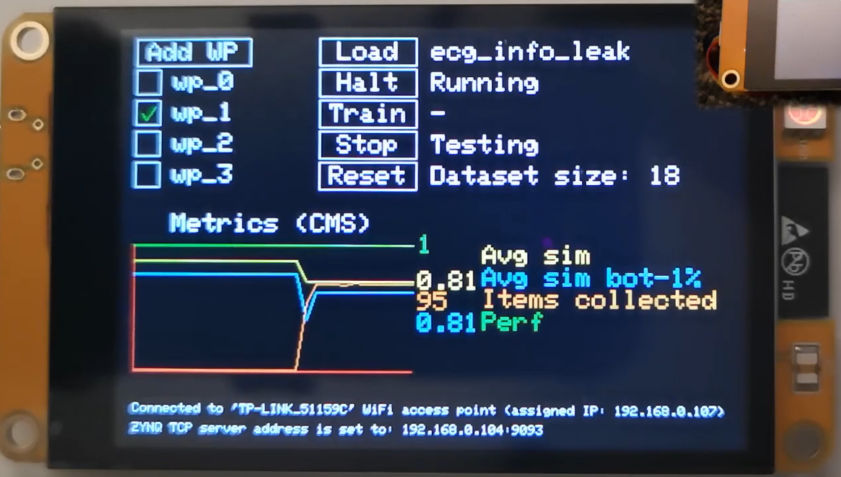
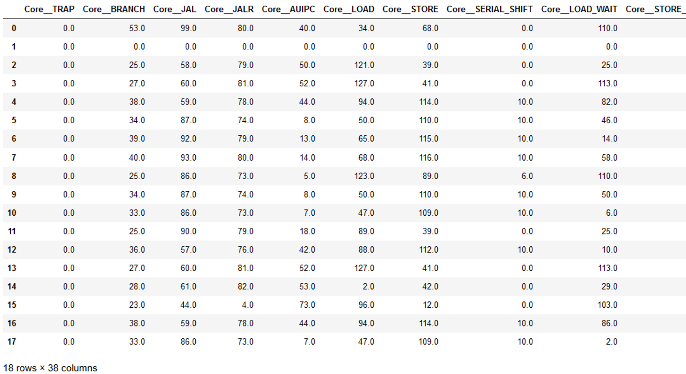
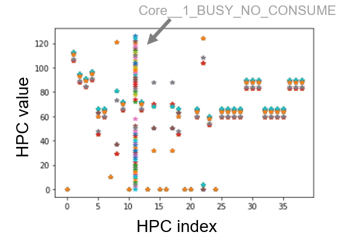

- [Video demonstration of the use case](#video-demonstration-of-the-use-case)
- [Hardware setup](#hardware-setup)
- [What is displayed on the CMS screen](#what-is-displayed-on-the-cms-screen)
    - [Regarding the ECG screen](#regarding-the-ecg-screen)
- [Dataset](#dataset)
- [ECG Program behaviour](#ecg-program-behaviour)

# Video demonstration of the use case

[Youtube link](https://www.youtube.com/watch?v=mMTVhH6iV2M)

In the video, PYNQ wrapper is used to detect anomalous behaviour of a CHERI-RISC-V processor. The test involved training a detection model using a baseline **ecg** program and then replacing it with a malicious equivalent versions:
* **ecg_info_leak** which leaks information through 2nd UART
* **ecg_zigzag** which modifies the collected ECG sensor data

Section [ECG Program behaviour](#ecg-program-behaviour) describes the behaviour of these programs.

During the video, the following steps were performed:
* The **ecg** program was loaded into the processor and the training stage was started.
* Training was ended and testing was started using the same program.
* The **ecg** program was loaded again to check if loading the program impacts the detection (checking for false positives), a false positive occured just after running the program.
* The **ecg_info_leak** program was loaded and the detection model was tested. Resulting in constant decrease in average similarity (Avg sim) metric (0.81) indicating anomalous behaviour.
* The **ecg_zigzag** program was loaded but the CMS did not recognize that it is anomalous.

# Hardware setup
This use case included hardware that pretend to be a real medical application (ECG monitor), for that purpose an AD8232 ECG sensor was used together with an ESP32-3248S035C board that displayed the heart activity wave. These were connected to the ZC706 board via the [custom extension board](sensors_extension.md) for digital and analog I/O.

Additional display was used to control the continuous monitoring system (CMS) and display metrics in real-time, this display received data from the TCP server running on PYNQ system (communicating through a router), unlike the ECG display which received data directly from the RISC-V program through UART.

# What is displayed on the CMS screen
  

WP stands for "watchpoint", a condition that must be satisfied to collect data item from the processor (data item that includes hardware performance counters and timing information). During the video, watchpoints were set to the entry of "wait_ms" function.

Metrics shown on the graph are:
* Average similarity of collected items to the most similar item in dataset (Avg sim).
* "Avg sim bot-1%" is the same but is based only on the 1% of collected items that had the lowest similarity.
* Items collected (number of items collected since last update sent to display).
* Perf (processor performance on the scale of 0-1, it goes lower if the processor needs to be halted because trace processing takes too long and the internal trace storage is full).

### Regarding the ECG screen
Electrodes were connected while running all 3 programs ("ecg", "ecg_leak_info", "ecg_zigzag"), the zigzag-like pattern (square wave) was the result of "ecg_zigzag" modifying the sensor values, however this didn't cause significant changes in performance counters readings and wasn't detected by the CMS.

# Dataset
The dataset consisted of hardware performance counters vectors collected during training stage. In the video the dataset size is shown to be 18, this means the dataset had 18 rows, each containing 38 performance counters values.

The Flute processor was modified to collect 39 performance event indicators, only 38 are used because CORE__1_BUSY_NO_COSUME values were too varying which increased the size of dataset and decreased detection accuracy too as shown in the diagram below.

While testing, cosine similarity of currently collected performance counters values was computed for all rows and the maximum one became a final confidence score in terms of program behaving normally (and got included into the "Avg sim" value). 

# ECG Program behaviour
The programs ran on CHERI-RISC-V Flute processor (implemented on FPGA of ZC706 board). All 3 programs were very simple, first they check if electrodes are connected (by reading 2 digital outputs of the ECG sensor), the check is repeated every second until electrodes are connected. If they are, then the program reads analog ECG sensor value and prints it through UART, which is received by the Esp32 microcontroller board with a display (which plots the data). Source code of programs can be found in the links below: 
* [ecg.c](https://github.com/michalmonday/riscv-baremetal-minimal-example-c/blob/flute_design/ecg/ecg.c)
* [ecg_info_leak.c](https://github.com/michalmonday/riscv-baremetal-minimal-example-c/blob/flute_design/ecg/ecg_info_leak.c)
* [ecg_zigzag.c](https://github.com/michalmonday/riscv-baremetal-minimal-example-c/blob/flute_design/ecg/ecg_zigzag.c)
