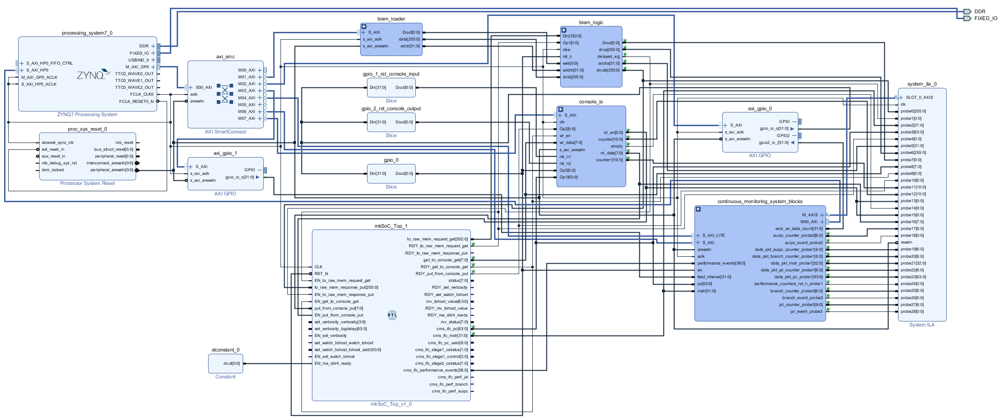
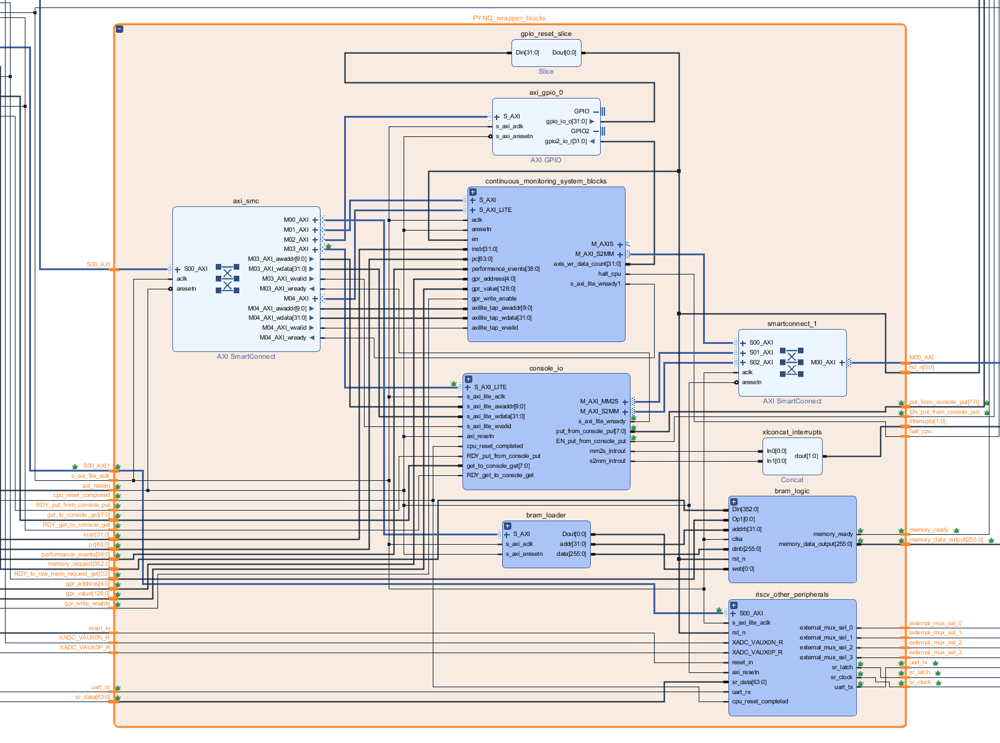
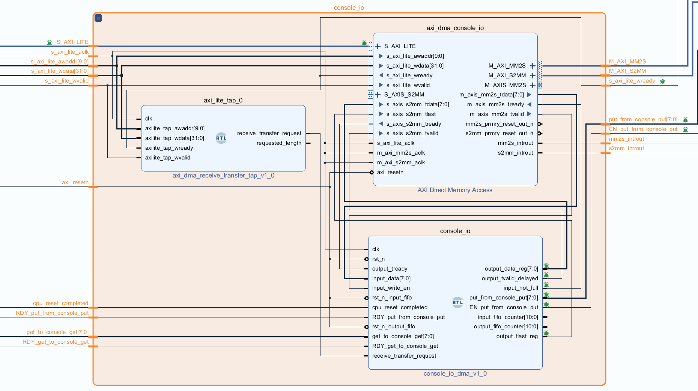
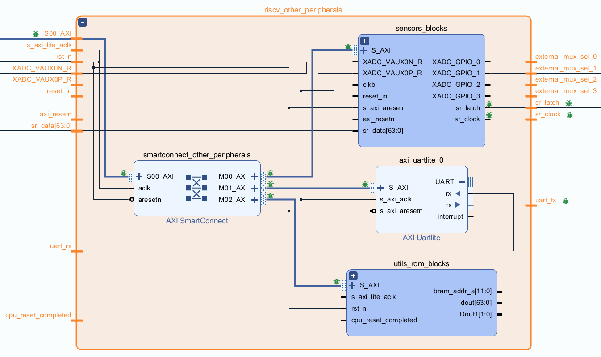
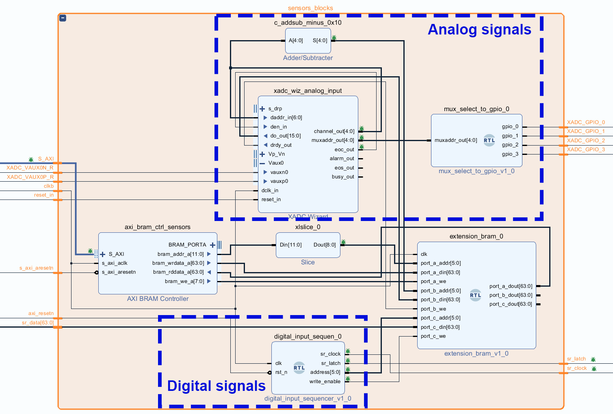
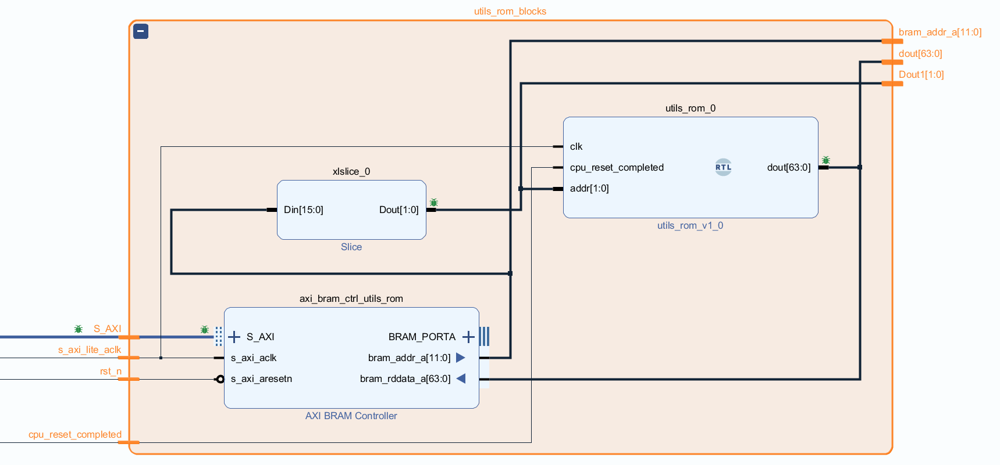
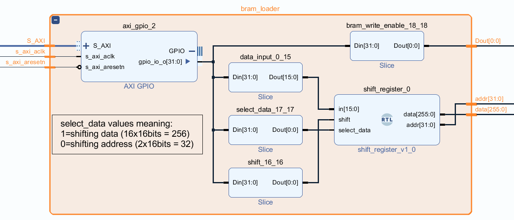
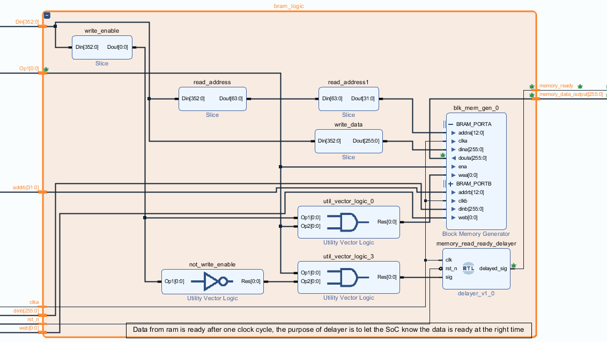

# Table of contents
- [Overview](#overview)
    - [Design style](#design-style)
- [Top level](#top-level)
- [PYNQ\_wrapper\_blocks](#pynq_wrapper_blocks)
  - [continuous\_monitoring\_system\_blocks](#continuous_monitoring_system_blocks)
  - [console\_io](#console_io)
  - [riscv\_other\_peripherals](#riscv_other_peripherals)
    - [sensors\_blocks](#sensors_blocks)
    - [utils\_rom\_blocks](#utils_rom_blocks)
  - [bram\_loader and bram\_logic](#bram_loader-and-bram_logic)

# Overview
This document describes design elements and provides references to documentation describing functionality of these elements. It contains some screenshots, however the best way to explore the design would be to create a new project in Vivado 2020.1 (targetting ZC706 board), import all sources from subdirectories of [vivado_files/src_verilog](../vivado_files/src_verilog/) directory and execute `source <absolute_path_to_tcl_script>` ([tcl script](../vivado_files/imported_design.tcl)) in Vivado Tcl console. This should recreate the block design with all modules/hierarchies, connections and settings.

### Design style 
Hierarchical blocks are heavily used in the design, this way it's easier to manage. It also uses "Add module" feature of Vivado which allows to insert a module written in Verilog/VHDL into block design without the need to package it into IP beforehand, such blocks have "RTL" label visible.

# Top level
At top level the Vivado design consists of 3 main components:  
* **CHERI_RISCV_Flute_mkSoC_Top** - top-level module of a RISC-V processor with CHERI security extension, modified by us to propagate signals relevant from behaviour profiling perspective (e.g. program counter, instruction, hardware performance counters, general purpose registers)  
* **ZYNQ_ARM_processing_system** - block that allows to configure and interface with the Zynq ARM processing system
* **PYNQ_wrapper_blocks hierarchy** - it encapsulates all the blocks that are responsible for trace collection, interfacing console I/O between RISC-V processor and the PYNQ script, loading BRAM with baremetal programs, providing the RISC-V access to analog and digital sensors readings, and other peripherals (e.g. timer, random number generator, memory)
  

# PYNQ_wrapper_blocks
PYNQ_wrapper_blocks hierarchy contains the following main components:  
* **continuous_monitoring_system_blocks hierarchy** - it encapsulates the continuous monitoring system (CMS) module as well as the internal trace storage (AXI4-Stream Data FIFO) wired to AXI DMA (allowing to retrieve the trace in the PYNQ script). It also contains "[axi_lite_tap](../vivado_files/src_verilog/custom_hdl/axi_dma_receive_transfer_tap.v)" component which recognizes that PYNQ script requested transfer from the DMA receive channel.  
* **console_io hierarchy** - it contains interface between the RISC-V processor console related signals and the AXI DMA dedicated for console I/O, allowing the PYNQ script to read program output and write program input. It also contains the "axi_lite_tap" component which recognizes that PYNQ script requested transfer from the DMA receive channel.
* **riscv_other_peripherals hierarchy** - it uses XADC wizard with external multiplexer mode enabled to provide analog sensor readings, it also controls 2 cascaded shift registers to provide digital sensor readings, it also contains a timer (for GetTickCount function) and a random number generator for the RISC-V processor.
* **bram_loader and bram_logic hierarchies** - these blocks allow the PYNQ script to load baremetal programs into BRAM (using AXI GPIO and a shift register to overcome maximum 32 bits AXI GPIO limit) and also let the RISC-V processor to read it. 

## continuous_monitoring_system_blocks
See [continuous_monitoring_system_configuration.md](./continuous_monitoring_system_configuration.md) for details about the CMS module functionality. [data_extraction.md](./data_extraction.md) provides some more related details (about CMS structure/functionality from the perspective of handling data).

Large number of "probe" output signals of the cms_ip_wrapper_0 component is there for debug/development purposes, these were wired to Integrated Logic Analyzer (ILA) block, which was deleted from the design before writing this documentation, to make the design more readable.

## console_io
Functionality of this block is described in [console_io.md](./console_io.md).

## riscv_other_peripherals

### sensors_blocks
sensors_blocks interacts with external hardware (multiplexer for analog sensors, shift registers for digital sensors), see [sensors_extension.md](./sensors_extension.md) for details about exact parts that were used and wiring.

### utils_rom_blocks
[utils_rom.v](../vivado_files/src_verilog/custom_hdl/utils_rom.v) file implements get_ticks_count, get_overlay_ticks_count and a random number generator functions mapped to RISC-V memory. See [flute_modifications.md](./flute_modifications.md) for details about how the RISC-V source code specifies memory location of these functions. To see how to interact with utils_rom block in C/C++ language see `utils_flute.h/.c` from [this directory](https://github.com/michalmonday/riscv-baremetal-minimal-example-c/tree/flute_design/include).

## bram_loader and bram_logic
[loading_and_running_programs.md](./loading_and_running_programs.md) describes functionality of these blocks.

