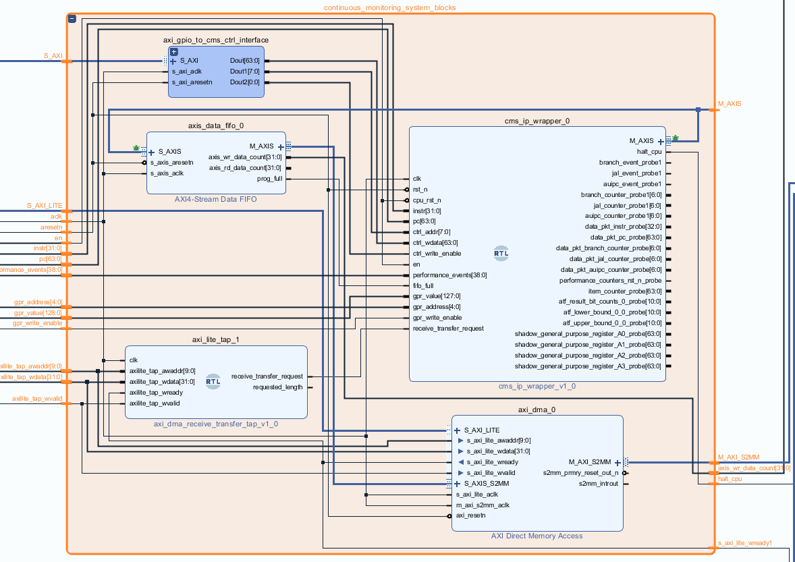

# Table of contents
- [Overview](#overview)
- [Top level](#top-level)
- [PYNQ\_wrapper\_blocks](#pynq_wrapper_blocks)
  - [continuous\_monitoring\_system\_blocks](#continuous_monitoring_system_blocks)
  - [console\_io](#console_io)
  - [riscv\_other\_peripherals](#riscv_other_peripherals)
  - [bram\_loader and bram\_logic](#bram_loader-and-bram_logic)

# Overview
Hierarchical blocks are heavily used in the design, this way it's easier to manage. It also uses "Add module" feature of Vivado which allows to insert a module written in Verilog/VHDL into block design without the need to package it into IP beforehand, such blocks have "RTL" label visible.

# Top level
At top level the Vivado design consists of 3 main components:  
* **CHERI_RISCV_Flute_mkSoC_Top** - top-level module of a RISC-V processor with CHERI security extension, modified by us to propagate signals relevant from behaviour profiling perspective (e.g. program counter, instruction, hardware performance counters, general purpose registers)  
* **ZYNQ_ARM_processing_system** - block that allows to configure and interface with the Zynq ARM processing system
* **PYNQ_wrapper_blocks hierarchy** - it encapsulates all the blocks that are responsible for trace collection, interfacing console I/O between RISC-V processor and the PYNQ script, loading BRAM with baremetal programs, providing the RISC-V access to analog and digital sensors readings, and other peripherals (e.g. timer, random number generator)
  

# PYNQ_wrapper_blocks
PYNQ_wrapper_blocks hierarchy contains the following main components:  
* **continuous_monitoring_system_blocks hierarchy** - it encapsulates the continuous monitoring system (CMS) module as well as the internal trace storage (AXI4-Stream Data FIFO) wired to AXI DMA (allowing to retrieve the trace in the PYNQ script). It also contains "axi_lite_tap" component which recognizes that PYNQ script requested transfer from the DMA receive channel.  
* **console_io hierarchy** - it contains interface between the RISC-V processor console related signals and the AXI DMA dedicated for console I/O, allowing the PYNQ script to read program output and write program input. It also contains the "axi_lite_tap" component which recognizes that PYNQ script requested transfer from the DMA receive channel.
* **riscv_other_peripherals hierarchy** - it uses XADC wizard with externam multiplexer mode enabled to provide analog sensor readings, it also controls 2 cascaded shift registers to provide digital sensor readings, it also contains a timer (for GetTickCount function) and a random number generator for the RISC-V processor.
* **bram_loader and bram_logic hierarchies** - these blocks allow the PYNQ script to load baremetal programs into BRAM (using AXI GPIO and a shift register to overcome maximum 32 bits AXI GPIO limit) and also let the RISC-V processor to read it. 

## continuous_monitoring_system_blocks

## console_io

## riscv_other_peripherals

## bram_loader and bram_logic

