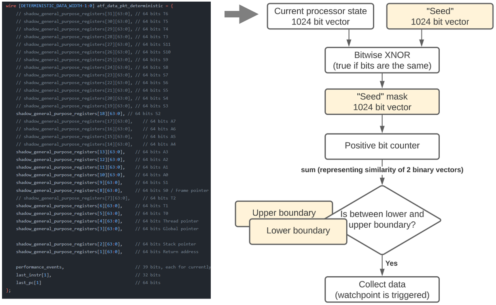

# Table of contents
- [What is meant by "watchpoint based tracing"](#what-is-meant-by-watchpoint-based-tracing)
- [Purpose](#purpose)
- [Shortcomings](#shortcomings)
- [Implementation](#implementation)

# What is meant by "watchpoint based tracing"
Watchpoint based tracing involves collecting execution metrics (like HPC vectors or timing information) whenever the processor state matches any of the previously set conditions. To form a condition that triggers a watchpoint, multiple attributes may be optionally included. The watchpoint set in figure below will collect data whenever the "wait_ms" (PC: 0x800007ec) function is called with the first argument (A0) being equal to 5. 

# Purpose
Watchpoint based tracing allows to collect data at intervals long enough for real-time anomaly detection in software. That's because the data is collected only when the condition is met.

# Shortcomings
* If watchpoint condition is triggerred too often, too much data will be collected and the software (Python script running on PYNQ) will not be able to keep up with data processing and collection. 
* Setting watchpoints is manual, it requires knowledge of a program, time and effort.
* Collected data can't be used to reconstruct the execution flow of the program (it can be used for recognizing that the program is acting in unusual way, so the tracing is anomaly-detection oriented).

# Implementation

All orange values on the diagram below can be set from the python script. The number of “seed” and ranges (lower/upper boundaries) per seed is variable. Currently the number of seeds is 16 (optionally enabled), each having up to 8 ranges.
Direct matching watchpoints are created by setting:
- desired values (e.g. PC and A0) in their corresponding positions within “seed” bit vector
- set corresponding bits to all 1’s in the “seed” mask
- set a single range (set both: upper range and lower range to the number of 1’s in seed mask)

Initially, lower/upper boundaries were used in attempt to find an automatic way of partitioning program execution (without manually setting watchpoint values). Only later the direct matching “rules” were introduced, that’s why this architecture may seem overcomplicated for checking if registers have specified values (direct matching).

Related code can be found [advanced_trace_filter.sv](../vivado_files/src_verilog/continuous_monitoring_system_src/advanced_trace_filter.sv) file. The python script responsible for controlling the hardware can be found in [advanced_trace_filter.py](../jupyter_notebooks/advanced_trace_filter.py) and [continuous_monitoring_system_controller.py](../jupyter_notebooks/continuous_monitoring_system_controller.py) files.